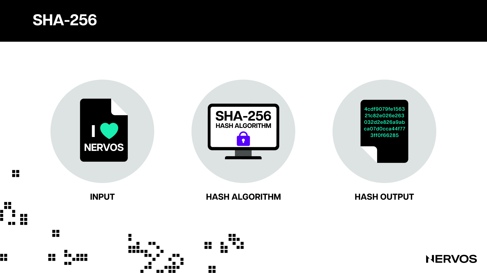
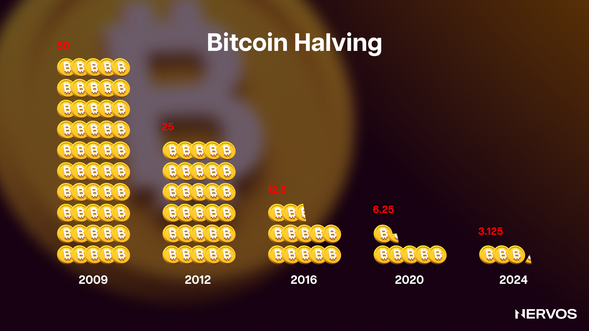

在比特币的每个四年周期中，尤其是减半事件前的六个月，关于其安全模型可持续性的讨论便会再度浮现。

这些讨论主要围绕两个对立观点展开：一方认为比特币的安全模型本质上是完善的，足以保证其长期稳定；另一方则指出，比特币的紧缩型货币政策和随之而来的长期依赖不断上涨的交易费用是不可持续的，最终可能导致其安全性大幅削弱，甚至带来风险。

虽然比特币社区中不少人视这个问题为已解决或不重要，但实际情况要复杂得多。这个问题涉及深层次的技术、经济和博弈论因素，本文旨在尽可能公正地阐述双方的主要论点。

## 工作量证明（PoW）解析

比特币区块链代表了一个公共交易数据库，该数据库在一个由称为节点的计算机组成的分布式网络中更新和复制。为达成对账本真实状态的共识，节点网络遵循一套名为[工作量证明](https://www.nervos.org/knowledge-base/why_is_proof_of_work_required) (PoW) 的协议规则。

在 PoW 共识机制中，一种特殊的节点类型——[矿工](https://www.nervos.org/knowledge-base/difference_between_miner_full_node_(explainCKBot))，负责验证和记录区块链上的交易。平均每十分钟，矿工会 “挖出” 一个新区块，里面包含自上一个区块以来发生的交易。每个新区块都通过加密方式与前一区块链接，从而形成区块链。区块链之所以很难被篡改，是因为在不重新挖所有后续区块（直到区块链的最新区块）的情况下，矿工无法更改特定区块的数据，而且这一过程需要耗费巨大的算力。

被添加到区块链中的区块所包含的交易被视为 "已确认"，这意味着用户可以使用他们在这些交易中获得的比特币。一笔交易被确认的次数越多，或者说在包含这笔交易的区块之上构建的区块越多，这笔交易被篡改几率就越低。

为了更新最新的交易块，矿工们必须争分夺秒地完成一项特定任务，即找到 [SHA-256](https://www.nervos.org/knowledge-base/SHA256_most_used_hash_function_(explainCKBot)) 加密[哈希函数](https://www.nervos.org/knowledge-base/what_is_a_hash_function)的有效哈希输出。

[哈希函数](https://www.nervos.org/knowledge-base/what_is_a_hash_function)是一种将任意长度的输入转换为固定长度输出的数学函数，其输出可视作输入的 “加密指纹”。哈希函数是 “单向” 的，意味着无法通过输出逆推输入。对于任何给定输入，生成的哈希值总是一致的，任何人都能使用相同的算法轻松计算和验证。

哈希算法的特点在于，除了通过尝试不同的输入之外，无法找到两个不同输入产生相同哈希输出的方法，也无法有意选择输入以获得特定的输出。

SHA-256 哈希算法的输出始终是 256 位，与输入的大小无关。[例如](https://xorbin.com/tools/sha256-hash-calculator)，"I Love Nervos" 的哈希输出为 4cdf9079fe156321c82e026e263032d2e826a9abca07d0cca44f773ff0f66285. 

如果我们对输入进行轻微的修改，例如在这句话话的末尾添加数字 1，即 "I Love Nervos 1"，我们会得到完全不同的哈希值：955146eb7dfa0d263b0fc8d943f642e26524435ae63a894a6f1879a259db0487。

在上面这个例子中，用于改变哈希函数输出的数字称为*随机数（nonce）*。

在比特币中，找到一个 “有效哈希值” 需要对区块头进行哈希运算，并检查输出是否低于协议设定的 “目标值”。如果不低于，矿工会通过改变随机数来不断尝试，直到找到符合目标值的哈希值。比特币协议通过要求矿工生成特定数量零开头的哈希值来设定目标，同时利用 “难度调整” 算法，每 2016 个区块（约两周）调整一次目标值，以保持平均 10 分钟的出块时间。

为了更好地说明其工作原理，我们假设矿工需要对 "I Love Nervos" 这句话进行哈希运算，直到产生一个以 1 个 0 开头的哈希值。通过不断修改随机数（末尾用作随机变量的数字），我们可以看到 "I Love Nervos 16" 这句话就产生了一个以 0 开头的哈希值： 0632ded6d4e4d0ee20f107eae3373d07d45d57a8a49d1b8668c38084880cb05e. 

这意味着需要 16 次尝试才能找到有效的哈希值。如果把目标设置为开头 4 个 0 的哈希值，那么我们平均需要数万次尝试才能找到符合要求的哈希值。在比特币当前的挖矿难度下，矿工必须集体尝试 10^18 次才能找到一个可以产生有效哈希值的随机数。

*图：比特币价格（黑线）和挖矿难度（蓝线），来源：[Blockchain.com](https://www.blockchain.com/explorer/charts/difficulty)* 

这里的关键点是，矿工要找到有效的哈希值，并挖出一个被网络中所有其他节点视为有效的区块，唯一的办法就是通过尽可能多地尝试不同的随机数来运算 SHA-256 算法。

为此，矿工们使用 [ASIC](https://www.nervos.org/knowledge-base/crypto_mining_hardware_(explainCKBot)) 芯片，这种芯片每秒可以计算数万亿次哈希值，但耗电量很大。这就是为什么这种共识算法被称为工作量证明——挖掘有效区块的唯一方法是通过实际的工作。由于 SHA-256 的确定性特性，如果不投入必要的算力，就无法产生有效的哈希值或伪造工作量证明。

## 比特币的安全预算

矿工们的努力不仅是为了获取有效的哈希值，而是为了赢取区块奖励，包括新生成的比特币（即 “区块补贴”）和交易费用。

区块奖励构成了比特币经济模型的核心。对于矿工来说，区块奖励是对挖矿所需的资本（硬件、不动产）和运营（电力、维护和员工工资）支出的投资回报。区块奖励激励着矿工们投入算力，以保护网络不受恶意攻击者的威胁。为了成功发起对比特币网络的 [51% 攻击](https://www.nervos.org/knowledge-base/what_is_51_attack)，攻击者需要控制至少 51% 的全网总算力，所以全网算力越高，攻击的难度和成本也就越大。

基本的经济学推理告诉我们，诚实的矿工愿意投入的总成本不会超过他们从区块奖励中所获得的收益。举个例子，如果一个区块的奖励是 1000 美元，矿工们可能愿意投入最多 999 美元来提高出块概率。矿工们愿意花费的总金额受其收入的限制，而收入的大头来自区块奖励，因此区块奖励才是真正决定比特币安全等级的因素。如果矿工们花大量的钱挖比特币，那么潜在的攻击者就得花更多的钱才能攻击比特币。

 *图：一名技术人员在一个大型比特币矿场检查 ASIC 矿机（来源：Lars Hagberg/AFP; Getty Images)*

这是我们必须消除的关于比特币安全模型的第一个误区。比特币的安全预算是由区块奖励决定的，而不是网络的总算力。名义上的高全网算力并不意味着高安全性，因为随着时间的推移，算力会受到[挖矿硬件](https://www.nervos.org/knowledge-base/crypto_mining_hardware_(解释CKBot))性能提升的影响（[摩尔定律](https://en.wikipedia.org/wiki/Moore%27s_law)）。换句话说，随着挖矿硬件效率的提高，获得固定算力的成本会降低。

举个例子，假设五年里比特币的总算力一直保持在每秒 500TH/S 左右，但同期挖矿硬件的效率提高了十倍。那么，比特币的安全性并没有保持不变，而是下降了十倍，因为恶意行为者攻击网络的成本已经降低了十倍。

当然，这个例子只是为了帮助大家更好地理解概念。在现实中，矿工们必须使用相对较新的设备才能获利，我们看到比特币的全网算力在不断增长中。

 *图：比特币挖矿难度（蓝线）和价格（黑线），来源：[Blockchain.com](https://www.blockchain.com/explorer/charts/difficulty)* 

决定比特币安全性的是挖矿成本，而不是名义算力。事实上，PoW 共识机制的全部意义就在于使确认交易（确保网络安全）和发行新加密货币的过程成本高昂。挖矿的过程让矿工们付出了巨大的成本，但也给了他们合适的激励，并以此激励他们保持诚实。

目前，比特币的安全预算（仅考虑运营成本）约为每天 [2560 万美元](https://www.crypto51.app/coins/BTC.html)。这意味着，如果攻击者想要持续一个月发起 51% 攻击，在所有条件不变的情况下，仅运营成本就需达到约 7.68 亿美元。此外，获得足够多挖矿设备的成本可能高达数十亿美元，且获取这些挖矿设备并非易事。考虑到迄今为止还没有人试图攻击比特币网络，我们可以得出这样的结论：比特币目前的安全预算绰绰有余。

这里需要注意的点是安全预算的组成。目前，大约 97% 的区块奖励来自区块补贴（每天 144 个区块 x 每个区块 6.25 BTC，当前价格为 27500 美元，相当于 2480 万美元），而交易费用仅占 3%（每天约 57.6 万美元）。

*图：交易费用占比特币出块奖励的百分比，来源： [Bitbo.io](https://charts.bitbo.io/fees-percent-of-reward/)* 

按照比特币的设计，区块补贴（即每个区块新产生的比特币数量）每四年减半（准确地说是每 210,000 个区块），直至 2140 年所有的 2100 万枚比特币被挖出。2009 年 1 月比特币网络启动时，区块补贴为 50 个比特币，2012 年 11 月减半至每个区块 25 个比特币。2016 年 7 月减半至 12.5 个比特币，2020 年 5 月再次减半至每个区块 6.25 个比特币。

为什么这很重要？因为从目前的情况来看，矿工的收入绝大部分来自区块补贴，而区块补贴注定会每四年就减半一次。这会让比特币网络陷入的困境：为了使安全预算保持不变，要么（i）比特币的价格必须每四年翻一番，要么（ii）来自交易费用的收入必须增长到足以补偿区块补贴下降。

从长远来看，第一种选择显然在数学上是不可能的。比特币目前的市值约为 5 万美元，如果其价格每四年翻一番，那么只需十个减半周期，其市值就会超过目前的[全球总财富](https://www.credit-suisse.com/about-us/en/reports-research/global-wealth-report.html) 4544 亿美元。如果比特币的价格在未来 40 年内停滞不前，那么安全预算会逐渐缩减至每天仅 25000 美元，使比特币网络极易受到 51% 的攻击。

接受了这一现实，我们就剩下核心问题了：比特币网络能否持续保持安全，并在不依赖区块补贴的情况下继续适当地激励矿工？

## 矿工支出： 安全性的度量

在讨论比特币是否能仅依靠交易费用来维持其安全性之前，我们需要对 “安全” 一词进行明确的定义。

其中一种衡量安全性的方法是设定一个_阈值_，即在超过特定的安全支出后，比特币被认为是绝对安全的，因为没有任何实体能够动员足够的资源来攻击它。然而，这个阈值到底是多少，我们无从得知。目前每天约 2560 万美元的安全预算是否足以长期保障比特币的安全性？是不是太低了？或者我们是否为了安全性支付了过高的溢价？谁也说不准。

单纯从绝对值或特定阈值来考虑安全预算，而不考虑网络价值，是有问题的。因为攻击网络的动机显然与网络的价值有关，甚至可能是成正比的。换言之，攻击比特币的潜在收益与其市场价格息息相关。由于比特币可以在市场上被卖空，攻击成功的价值随着比特币自身的市场价值而变化。

因此，更合理的方式是将攻击成本与网络价值联系起来。

这意味着，只有当比特币保持一定的安全系数（定义为攻击成本与网络价值的比例）时，它才能被认为是足够安全的。举个例子，目前攻击一个价值 5000 亿美元的网络，每小时的成本约为 110 万美元（即 1.1/500 = 0.22% 的安全系数）。这可以被认为是一个足够的安全系数，因为目前还没有人试图攻击比特币网络。然而，如果比特币的市值增长到 5 万亿美元，而攻击网络的成本保持不变，那么安全系数将下降 10 倍（即 1.1/5000 = 0.022% 的安全系数）。0.022% 的安全系数是否足够，谁也说不准，但肯定比 0.22% 的安全系数要差。

## 交易费用（矿工费）

上文提到，比特币必须维持相对较高的安全预算（安全系数）才能保持安全。这意味着必须进行有效的权衡，用交易费用的增加来替代区块补贴的减少。纯交易费用安全模式的可行性，是比特币社区争议的主要来源，双方的预测截然相反。

简单地说，乐观主义者，包括比特币的创始人中本聪，认为随着网络规模的扩大和价值的增长，对区块空间的需求将自然增加，从而提高交易费用收入，减少对区块补贴的依赖。比特币的区块空间是稀缺的，是一种独特的商品，因为没有替代品——类似于优质的房地产。比特币目前是最安全的区块链，在可预见的未来也将继续如此。因此，在比特币上进行交易，可以看作是购买稀缺的区块空间，与在任何其他网络上进行交易相比，能带来不同的好处，包括安全保证，这意味着用户（理论上）愿意支付溢价。

这些乐观主义者进一步设想，未来比特币将成为国家金融系统的主要结算层，而大部分小额支付将通过 Layer 2 网络（如闪电网络）进行，比特币网络只是偶尔结算来自 Layer 2 的结算交易。另一方面，比特币区块链本身将专门用于关闭闪电网络通道、高净值个人与商业银行和中央银行等金融机构之间高价值交易的最终结算。在这种情况下，手续费可以在不损害区块空间需求的情况下轻松飙升到数千美元。乐观主义者认为，这笔安全预算加上每个人的参与，将足以维持比特币的安全性。

悲观主义者则描绘了一幅更加黯淡的图景。他们承认比特币作为最高价值储存资产的地位无可争议，但他们怀疑比特币网络作为支付平台的交换媒介的能力或竞争力。到目前为止，比特币是有目的地针对去中心化而不是可扩展性进行优化的。要将安全预算的负担分摊到更多的交易中，就需要增加区块空间，缩短区块时间，或者两者兼而有之。然而，这样做会大大提高运行全节点的硬件要求，影响去中心化。考虑到即使是乐观主义者也不主张这种改变，比特币只能对其稀缺的区块空间收取溢价，作为确保足够安全预算的唯一选择。

悲观主义者还指出，交易费用会受制于经济学家所说的 "[需求的价格弹性](https://www.khanacademy.org/economics-finance-domain/microeconomics/elasticity-tutorial/price-elasticity-tutorial/a/elasticity-in-the-long-run-and-short-run)"。用户可能想持有比特币，但这并不意味着他们愿意支付高昂的交易费用来使用比特币进行交易。从古至今，经济中的所有东西每年都在明显地变得更便宜、更有弹性、更有竞争力。弹性的最大驱动因素之一是时间，即在短期内，用户可能无法搜索到替代品，可能愿意支付溢价，但从长远来看，情况恰恰相反。

也就是说，人们对创新和降低交易成本有着本能的向往，比特币支付也不例外。作为一种支付平台，比特币并不是孤立存在的，而是被竞争者所包围，其中包括法定支付处理器、其他更具扩展性的加密货币，甚至像闪电网络这样的 Layer 2 网络。虽然用户可能会支付一定的溢价在安全的网络上持有比特币，但他们支付高昂的费用进行交易是没有意义的。比特币交易是即时的，交易者对网络的长期安全性没有既得利益。只要他们的付款一结算，他们就完事了，根本不在乎比特币会发生什么。另一方面，比特币的长期持有者对网络的长期安全有既得利益，但除了一次性的交易费用外，没有其他支付机制。

此外，悲观主义者还指出，目前没有任何经验或者证据表明比特币交易费用可以长期保持高位。除去前几次牛市高峰附近的短暂狂热期，比特币的交易费用一直保持在较低水平。

*图：每笔比特币交易的交易费用（蓝线）和比特币价格（黑线），来源：[Blockchain.com](https://www.blockchain.com/explorer/charts/fees-usd-per-transaction)* 

乐观主义者反驳说，历史数据无法预测未来。但即便如此，如果比特币要达到今天每天 2560 万美元的安全预算，仅靠交易费用，平均交易成本就必须达到 85 美元。如果市值达到 5000 万美元，假设区块补贴为零，平均交易费用必须保持在 850 美元，比特币才能维持相同的安全系数。可以说，与目前每笔交易约 2 美元的平均费用相比，还有很长的路要走。

尽管交易费用维持在 850 美元的预期似乎高得难以置信，乐观主义者却认为这并非不可能。他们认为，比特币在新颖的应用方式上有着潜在的独特价值，这些创新应用可能为比特币系统带来全新的经济效益。例如，像 [Rollkit](https://rollkit.dev/) 这样的项目，它利用比特币作为其他区块链数据的可用层，或像 [BitVM](https://www.bitvm.org/) 这样的项目，它使得比特币能够执行一般计算，这些都极大扩展了比特币系统的应用范围。这种多元化使用有可能证明交易费用比我们认为简单转账的合理费用要高得多。

然而，基于交易费用的安全模型持续存在的问题是，与为矿工提供稳定且可预测的收入来源的区块补贴不同，交易费用收入具有不稳定性，容易受到市场供需变化的影响。这种波动性可能会诱发复杂的 MEV 攻击，吸引矿工去分叉 “富裕” 的区块以 “窃取” 奖励，矿工被激励着去重组区块链，为自己开采最高奖励的区块，进而导致比特币不稳定、不安全和糟糕的用户体验。

最后，或许也是最重要的一点，在完全基于交易费用的安全模式中，网络的平衡被完全打破，开始进入死亡螺旋。这是因为，如前所述，区块补贴是恒定的、可预测的，只有在每四年减半一次时才会发生变化，而交易费用收入是可变的，根据区块空间需求不断变化。

当区块空间竞争很少或没有时，交易费用较低甚至接近于零。当区块容量达到 80% 左右时，我们观察到交易费用会开始显著上涨，随后随着容量的进一步增加而逐渐趋于稳定。这一现象在 2016 年的开创性研究《[没有垄断者的垄断……](https://academic.oup.com/restud/article/88/6/3011/6169547)》中得到了详尽的实证分析。

现行的区块奖励机制为比特币网络提供了一个相对稳定的平衡。在这一平衡中，交易需求和供给共同决定交易费用的水平，而区块奖励（包括区块补贴和交易费用）则决定了网络的总算力或安全预算。我们知道，比特币的使用成本会影响用户的交易意愿，从而进一步影响交易量。也就是说，成本上升会对交易需求产生负面影响，而交易需求上升又会推高网络使用成本。这种自我纠正机制最终会将比特币生态系统推向一个相对稳定的平衡状态，即区块空间接近饱和，交易费用趋于稳定。然而，由于交易费用在区块奖励中所占比重较小，其波动对矿工的挖矿动力或网络安全性的影响相对有限。

但在完全依赖交易费用的安全模式中，平衡的维持变得更加复杂。在这种模式下，安全预算完全取决于交易费用，而安全预算的高低又会影响交易需求，因为人们不太愿意在不安全（或安全性较低）的网络上进行交易，这是合理的预期。理论上，这可能导致 “死亡螺旋”，即较低的交易费用导致安全性下降，安全性的降低又进一步减少交易或区块空间的需求，从而导致交易费用进一步下降，进一步降低安全性，如此循环。

换言之，无论是在当前的奖励机制下，还是在完全基于交易费用的安全模式下，都存在一种向下拉低交易费用的趋势。然而，在前者情况下，区块补贴起到了一种平衡作用，为安全预算的下降设定了一定的限制。而在后者情况下，缺乏这种平衡机制，因此，降低交易费用的趋势同时也在推动网络安全性的下降，容易触发 “死亡螺旋”。

因此，除非我们对潜在的攻击方式有充分的了解，并明确了这些攻击可能带来的后果，否则对于何种安全模式最为适宜的讨论将无法得出实质性结论。关键在于，我们需要清楚地认识到比特币网络究竟需要防御哪些类型的攻击，以及这些攻击可能带来的潜在影响。

## 51% 攻击与防御策略

比特币网络的安全性通常围绕着所谓的 51% 攻击进行讨论。这种攻击形式涉及到一个或多个恶意行为者控制超过半数的网络算力，使得他们有能力以多种方式破坏网络秩序，其中包括执行双花攻击、通过挖空区块或只包含攻击者交易的区块来审查交易，以及欺骗轻客户端（[SPV 客户端](https://www.nervos.org/knowledge-base/ultimate_guide_to_light_clients)），使其变得毫无用处。

在正常情况下，矿工根据一系列标准检查交易、验证交易，将其打包成区块，然后竞相寻找工作量证明或低于协议阈值的哈希值。当网络中的其他节点收到新区块时，他们会检查其中是否包含有效的工作量证明，如果包含证明，他们就会将其视为有效区块，并将其附加到他们的区块链副本中。

然而，挖矿本质上是一个概率游戏，有时会出现两个矿工几乎同时找到有效哈希值的情况。当这种情况发生时，网络中的其他节点就不得不在同一区块高度的两个不同（有效）区块 A 和 B 之间做出选择，而这两个区块引用的是同一个父区块 C，此时区块链出现了[分叉](https://www.nervos.org/knowledge-base/what_is_a_hard_fork_soft_fork_(explainCKBot))。由于真正的规范链只能有一条，因此 PoW 共识机制通过 "最长链原则" 来解决这一问题。

最长链原则（也称为 "最多工作量证明的链"）是指，当节点面临区块链分叉时，他们必须始终采用耗费最多能量构建的链作为标准链，并将竞争区块（孤块）作为无效区块丢弃。

两个矿工同时提出两个不同的有效区块，并引用同一个父区块，这种情况比较常见。不过，这种情况连续发生两次、三次或四次的可能性微乎其微。

这意味着分叉发生后，矿工最终会找到一个区块 D，该区块 D 引用同一高度的两个竞争块之一（例如区块 B），并在其之上构建区块。一旦发生这种情况，两条竞争链中较长的一条（C>A 和 C>B>D）将胜出并被网络视为规范链。在这个例子中，C>B>D 链有更多的区块，这意味着它需要更多的能量来构建它，因此是规范链。

这意味着，控制 51% 及以上算力的攻击者可以超越网络中的其他矿工，以更快的速度挖出区块，从而获得对规范链的垄断权。一旦做到这一点，他们就可以挖空区块或只包含自己交易的区块，以及将所有其他网络参与者排除在网络交易之外。

此外，51％的攻击者可以通过将比特币发送到交易所卖出，提取法币，然后重组区块链以取消原交易，从而实现双花攻击。如果区块链重组成功，攻击者还可以从他们开采的区块中获得区块奖励，抵消一些攻击成本。

在这一点上，许多专家认为，即使安全预算下降，比特币的安全性也未必受到致命影响，因为用户可以通过等待更多的确认来降低双花攻击的风险。例如，交易所可能要求 60 次确认而不是现行的 6 次，这样就可以大大降低双花攻击的几率，因为重组 60 个区块的成本至少是重组 6 个区块的十倍。

然而，这种观点忽略了一个关键点：如果攻击者能支付全部的安全预算，他们就能控制每笔交易的确认次数，因为安全预算就是 100% 算力的成本。在这种情况下，无论等待多少次确认，攻击都不会结束。当诚实的矿工意识到他们在算力竞争中处于劣势并关闭他们的挖矿设备时，攻击的成本最终甚至可能降至零，导致网络安全性彻底崩溃。

## 51% 攻击和不可抗力

比特币乐观主义者犯的另一个错误，是完全相信协议的激励结构，没有跳出这个结构来思考问题。他们理所当然地认为，对大多数矿工而言，诚实地参与挖矿并从区块奖励中获益，远比攻击网络并可能面临各种反击或其他类型的打击要好得多。确实，一旦发生大规模攻击，诚实的比特币用户群体并非束手无策，他们可以通过实施复杂的防御措施来抵抗 51% 攻击，例如改变哈希算法、设置检查点、使用老式挖矿设备来稀释攻击者的算力份额，以及进行难度调整，等等。

然而，这种论点的前提假设是所有矿工都是理性的，他们不会因为攻击比特币而获得任何好处。即便如此，如果考虑到纯粹出于非理性目的的恶意攻击，这种论点便站不住脚了。这时，重点就不再是攻击者的利益，而是 51% 攻击比特币的难度和成本了。因此，关键在于确保安全预算足够高，以防止这类攻击的发生。

值得一提的是，现实中出现这种极端情况的可能性非常低。大多数个人和团体都是理性的行为者，因此攻击比特币的决定通常基于某种主观经济或政治利益。随着比特币的日益普及，攻击它所带来的社会和政治成本会不断增加，因为越来越多人的生计与比特币密切相关。

一个民族或国家是否具备实施 51% 攻击并摧毁比特币的能力，不仅取决于其技术和经济实力，还取决于这种行动在政治上（甚至地缘政治层面）的可行性。在此不一一赘述，总之，攻击比特币的动机越强烈，保卫比特币的动机也就越强烈。理论上，针对每种潜在攻击都可以设计出有效的防御策略，反之亦然。而且，考虑到攻击可能带来的巨大损失，单单是成功防御的可能性就足以威慑潜在的 51% 攻击者。

### 优化比特币安全模型：CKB 的创新之举

与比特币一样，Nervos 的底层公链 CKB 也针对去中心化和安全性进行了优化。不过，与比特币不同的是，CKB 更加注重去中心化，并采用了与平台的价值存储特性相一致的安全模式。

比特币基于交易费用的安全模式并不适合真正的价值存储或保值平台。比特币的持有者通过支付一次性交易费用，就可以在区块链上无限期地存储价值。此外，这种模式与比特币通过 Layer 2 网络提高交易量的目标存在矛盾，因为 Layer 2 网络的交易费用并未直接贡献给比特币矿工。

CKB 在设计之初就已充分考虑到了这些问题，并作出了相应改进。CKB 采取了[两种代币发行机制](https://www.nervos.org/knowledge-base/tokenomics_of_nervos_network)：一级发行和二级发行。一级发行与比特币类似，设有硬顶限制，有一个固定的发行时间表，大约每四年减半一次，直到基础发行的所有代币发行完毕。二级发行则不设上限，并遵循每年 13.44 亿 CKB 的固定发行计划。

与一级发行完全归矿工所有不同，二级发行根据 CKB 代币在链上的使用情况，在矿工、Nervos DAO 储户和 Nervos 国库之间进行分配。举个例子，假设所有流通的 CKB 中，有 50% 用于存储状态，25％ 存于 Nervos DAO。在这种情况下，50% 的二级发行将归矿工所有，25% 归 Nervos DAO 储户所有，剩下的 25% 归国库所有（目前直接销毁）。

这一代币经济学设计实现了两个目标：

其一，通过将区块链安全与其作为价值存储平台的功能联系起来，确保了网络的长期可持续性。CKB 矿工的收入不再依赖不稳定的交易费用，而是来源于可预测的区块补贴奖励。值得注意的是，二级发行引起的通胀仅影响链上状态占有者，因为长期持有 CKB 并存入 Nervos DAO 的用户可以免受其影响。通过这种通胀税，状态占有者持续地补偿矿工所提供的安全保障。

其二，这一代币经济学设计解决了 "公地悲剧" 问题，即长期占用者滥用网络存储空间，而无需为此支付适当费用。具体来说，在 CKB 区块链上存储数据需要锁定必要数量的 CKB。CKB 代币实际上代表了以字节为单位的存储容量，一个 CKB 赋予持有者在区块链上存储一个字节数据的权利。这意味着 CKB 上的链上状态空间实际上是私有化的，从而减少了状态臃肿，因为状态占用者总是有动力优化并占用尽可能少的链上状态空间，以避免支付过高的状态租金。

此外，由于区块奖励以 CKB 计价，而持有 CKB 可以在链上存储数据，因此 CKB 区块链的安全性可以根据平台的价值存储需求而增减，而不是根据其作为支付网络的使用情况而增减。较高的安全预算会吸引更多矿工来确保网络安全，而高安全性则会进一步吸引用户在网络上存储更多价值。

CKB 的安全模式旨在创建一个正循环：存储在链上的价值越多，网络的安全性越高；安全性越高，吸引存储的价值也越多。由于 CKB 主要作为价值存储平台，而非交易媒介，因此其长期安全性与历史交易量关系不大。

有趣的事，随着 CKB 变得更加安全，Nervos 网络的可扩展性也会提高，因为 CKB 的高安全性会吸引开发者在其上构建更注重性能的 Layer 2 网络。这样一来，Nervos 既实现了长期可持续的安全性和链外可扩展性，又提供了一种原生代币，对其长期持有者来说，这种代币是一种稀缺的、不通胀的资产。

