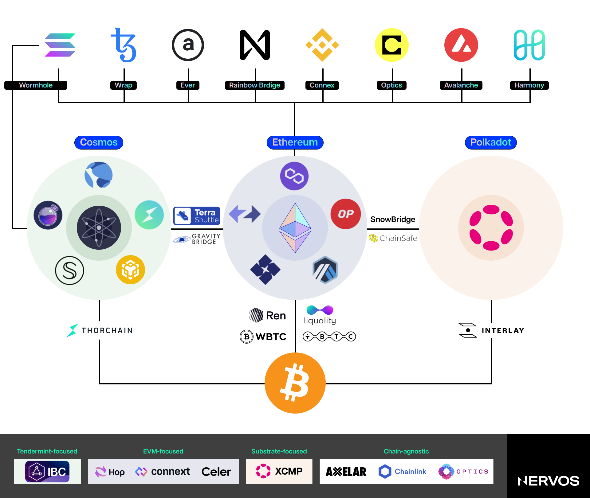
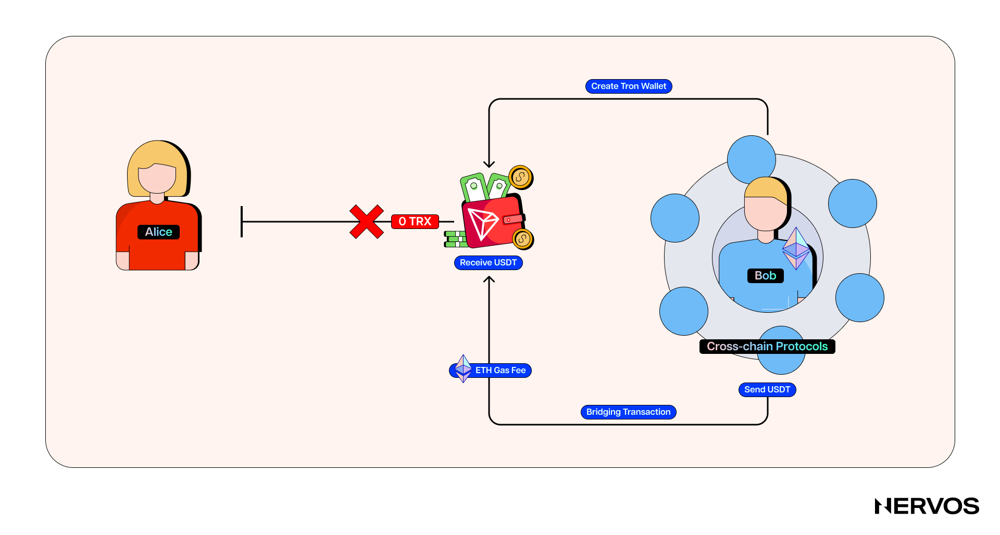
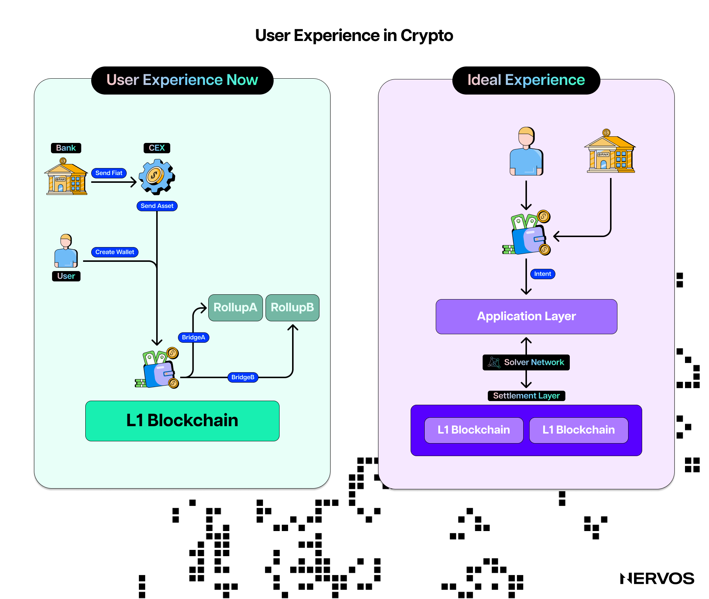
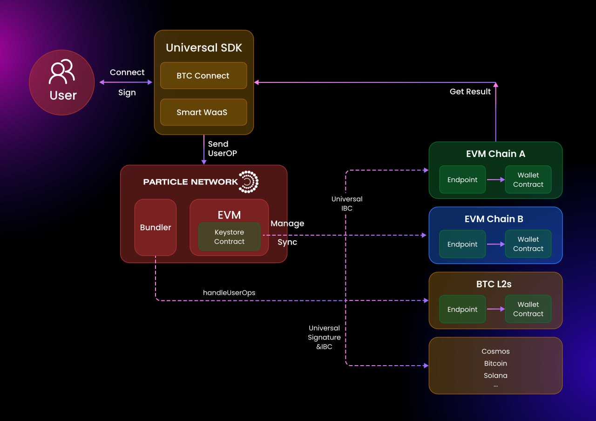
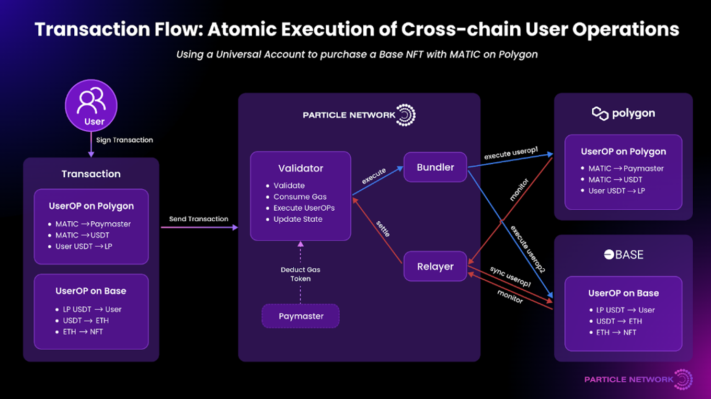

While using blockchain technology has never been an outstanding experience, the recent proliferation of numerous blockchains, sidechains, [state channels](https://www.nervos.org/knowledge-base/what_are_payment_channels), and [rollups](https://www.nervos.org/knowledge-base/what_are_optimistic_rollups) has made it even worse. In fact, the current UX is so bad that it has gotten to the point where even crypto natives occasionally struggle with Web3 dApps—especially in the cross-chain context—and must often look up projects’ technical documentation to understand how exactly to use them.

On the other hand, for the average person dipping their toes into Web3, the level of friction can be almost insurmountable. The Web2 world didn’t reach mass adoption by expecting users to understand the intricacies of HTTP, TCP/IP, or web hosting. 

Mass adoption of the internet was reached because billions of dollars over the course of decades were spent improving and optimizing the user experience, getting it to the point where subscribing to a new service or creating a new social media account takes no more than a simple email sign-in and no more than a few clicks to order something online.

For industry outsiders accustomed to this level of smoothness, entering Web3 feels almost like traveling back into the past, before UX considerations were even a thing. Nothing about the experience feels intuitive, from creating wallets to waiting for transaction confirmations, dealing with pending and failed transactions, or managing assets across different chains.

Being fully aware of these issues for years, many industry constituents have recently started working on [chain abstraction](https://www.nervos.org/knowledge-base/what_is_abstraction_%28explainCKBot%29)—the process of “abstracting away” or hiding the complexities of dealing with Web3 applications in the multi-chain era. Some focus on specific chain abstraction verticals, like building account abstraction wallets or cross-chain asset management dApps, while others take a more holistic approach, targeting every UX pain point simultaneously. 

However, to understand the state of play in chain abstraction, it’s first necessary to examine what this initiative is trying to solve, and what precisely these UX pain points are.

## What Using Blockchains Looks Like Today

Everyone’s entry point to the crypto world is their wallet, which is where the first UX issues begin.

Managing crypto accounts is nothing like managing Web2 accounts. It involves securing private keys and [mnemonic phrases](https://www.nervos.org/knowledge-base/what_is_a_seed_phrase_(explainCKBot)) that typically can’t be recovered when lost. Beyond that, interacting with dApps across multiple chains means managing multiple wallets, addresses, and balances, constantly switching between different networks, and tracking various gas tokens. 

Bridging between the different blockchains and Layer 2 networks is itself complex, with users needing to identify the correct bridging protocols, approve the transactions, pay the gas fees, and sometimes wait up to five days to receive their tokens on the destination chain. To make things worse, all of this occurs in a highly volatile environment, where the price of the underlying assets and the costs for each transaction change every second based on asset and blockspace demand.

Furthermore, the users traversing the cross-chain world must be aware of the technical differences between the blockchains and Layer 2 networks. Every network has different consensus mechanisms, blockspace and [blocktime](https://www.nervos.org/knowledge-base/block_time_in_blockchain_(explainCKBot)) parameters, as well as transaction and smart contract [execution environments](https://www.nervos.org/knowledge-base/comparing_blockchain_virtual_machines)—all of which render different security assumptions and user experience expectations. 

For example, a user accustomed to using wrapped Bitcoin (wBTC) on Ethereum could be caught off guard by the 30-minute confirmation times on the Bitcoin network. Similarly, a user accustomed to using USDT on Tron could be unpleasantly surprised by the high transaction fees when moving the same asset on Ethereum. Even then, paying the gas premium for transacting on Ethereum may feel like a bargain after failed attempts to submit a transaction to Solana.

These examples pale in comparison to the frustrating user experience that is simply moving assets across chains. Suppose Bob received a USDT payment on Ethereum and wants to move it to the Tron network to send money to his sister Alice overseas inexpensively. To do this, Bob must (a) find a suitable cross-chain protocol that allows him to do this and (b) create a Tron wallet. After he does this, he initiates a bridging transaction on Ethereum, pays the hefty gas fee in ETH, and receives the USDT in his Tron account within a couple of hours. 

However, immediately after receiving the USDT on Tron, Bob realizes that he can’t send any of it to Alice because he doesn’t have any TRX to pay the transaction fees on the network. Bob is now stuck, unable to move his money until he finds a way to acquire Tron’s native token.

While this simple scenario showcases how frustrating moving assets across two chains can be, the frictions escalate exponentially with more complex use cases, including swapping tokens across unsupported chains or providing liquidity cross-chain.

Instead of needing just two wallets and a single bridge to transact, crypto power users must often juggle multiple accounts across blockchains, use several bridges to get from one place to another, and hold multiple tokens to pay for the transaction fees on the respective networks along the way. 

To top it all off, they end up with fragmented liquidity and balances that are difficult to track and manage. This fragmented experience is not just intimidating to newcomers but also imposes significant security risks. Each additional step increases the chances of a mistake, which can lead to a permanent loss of funds, as crypto transactions are irreversible.

## How Using Blockchains Should Look Like

The core premise behind chain abstraction is that Web3 users shouldn’t even know they’re using blockchains, let alone care about whether they’re on a Layer 1, a rollup, or which cross-chain protocol to pick. They should be able to onboard, transact, explore dApps, recover their accounts, and offboard effortlessly—just like they do in Web2.

To that point, chain abstraction shouldn’t be viewed as a specific technical solution but as a goal. In a chain-abstracted world, users open a wallet with their fingerprint or email address without needing to secure and manage private keys and mnemonics.

They visit an application, connect their account-abstracted wallet, and declare their desired outcome, whether it be swapping one token for another, auctioning an NFT, lending, borrowing, staking an asset, or providing liquidity on a decentralized exchange. 

Beyond their desired outcome and the associated costs, users don’t (and shouldn’t) care much about anything else. All complexities associated with fulfilling the user’s intent should be hidden from them and handled either by separate entities or the tech itself. This means that the origin and destination chains, accounts, gas fees, bridging, and the actual execution should all become background details, largely irrelevant to the user.

*The CAKE framework by Frontier Research. (Source: [frontier.tech](https://frontier.tech/the-cake-framework))*

While different industry constituents naturally have different views on how to move from the current status quo to this new chain-abstracted world, [Frontier Research](https://frontier.tech/)'s recently proposed Chain Abstraction Key Elements ([CAKE](https://frontier.tech/the-cake-framework)) framework is beginning to gain significant traction among the projects working on the issue. Namely, the CAKE framework proposes unifying three infrastructure layers under a single product and gives examples of how to do that. The breakdown of the three infrastructure layers goes as follows: 

* **Permission Layer:** This layer refers mostly to wallets and the associated infrastructure for signing transactions. The core idea or goal here is [account abstraction](https://www.nervos.org/knowledge-base/account_abstraction_where_were_going)—the process of decoupling the signer-the object authorized to initiate transactions or spend tokens, from the account or the object holding the tokens. This also involves changing the cryptographic logic of how blockchain accounts are constructed to make them compatible with native multi-signature schemes and social recovery methods.

    This means chain-abstracted wallets need to support the signing schemes and transaction payloads for all the chains they want to support, which isn’t typically the case. The key innovations currently being explored here are AA wallets and Policy-based agents. AA wallets allow users to hold their private keys but separates the signer from the transaction executor, enabling specialized third parties to bundle and execute the users’ transactions, which also mitigates users’ need to hold fee balances on each chain. 
    
    Policy-based agents hold the user’s private key in a separate execution environment and generate signed messages on behalf of the users. This means users only need to create their policies and sign a single approval, and these agents handle all subsequent signing of sub-transactions and fee management.

* **Solver Layer:** Solvers are specialized entities that fulfill users’ [intents](https://www.nervos.org/knowledge-base/intents_an_old_idea_wrapped_in_new_clothing) by constructing and executing transactions on their behalf. They decide the exact transaction execution paths and estimate the fees and execution speed, based on users' initial balances and communicated intents.

    Solvers are a key chain abstraction element, as they abstract away all the complexities of transaction construction and execution, allowing users to declare only their desired outcome (intent) in a declarative format. For example, instead of manually bridging their assets across chains and finding the best execution paths, users can simply state, “I want at least 420,000,000 MEME tokens on Avalanche; here is 0.3 ETH waiting in this Ethereum contract,” and a network of solvers will compete to fulfill this intent to the best of their ability in the background.

* **Settlement layer:** After the user approves the transaction with their private key, the settlement layer ensures its execution. In a multichain world, this requires cross-chain oracles and different types of bridges, like liquidity and burn/mint bridges. If the users’ intent is being handled by a solver, solvers can also bring their own liquidity into the mix, removing the need for bridging. All of these solutions carry different trade-offs in terms of speed, cost, and security, so it’s up to the dApps to find the correct balance.

Frontier’s CAKE framework aims to give developers building chain-abstracted products a novel, structured approach to the issue. “Achieving Chain Abstraction means combining the above three infrastructure layers into a unified product,” Frontier states. How exactly this should be done is up to the dApps developers themselves.

## Chain Abstraction: Case Studies

To the above point, numerous projects in the industry have been developing products that abstract different aspects or layers of the CAKE framework. However, in this article, we’ll cover only the most popular of those that have taken a holistic approach to chain abstraction.

### CKB

[Nervos Network](https://www.nervos.org/) is among the first projects to consider chain abstraction when designing a Layer 1 blockchain: Common Knowledge Base (CKB). It achieves genuine protocol-level account abstraction using a very low-level RISC-V-based VM with zero precompiles and an utterly abstract data model called the [Cell model](https://medium.com/nervosnetwork/https-medium-com-nervosnetwork-cell-model-7323fca57571).

The [CKB-VM](https://docs.nervos.org/docs/getting-started/how-ckb-works) is a low-level runtime environment that allows developers to code as close to bare metal as possible. Unlike other blockchain virtual machines (VMs), like the EVM, the core cryptographic primitives aren’t precompiled into the VM but run in the same environment as smart contracts created by application developers. 

This means that dApp developers can use virtually any hashing algorithm or signing scheme they’d like and build universal applications that can be accessed with accounts from any blockchain wallet.

Existing crypto users don’t need to install new wallets or create new accounts to use CKB dApps. Instead, they can use their TrustWallet or MetaMask wallet, and Ethereum, Bitcoin, or even Dogecoin accounts to sign transactions on CKB. 

Moreover, CKB dApps can be accessed by a much bigger audience than crypto users, as CKB can verify any cryptographic primitive, including those widely used by Internet protocol standards.

Using [OpenID](https://en.wikipedia.org/wiki/OpenID) or other popular face and fingerprint recognition authentication mechanisms, they can access CKB dApps from their browsers or mobile phones. This is what proper account abstraction looks like; the account (the object holding the assets) on Common Knowledge Base can be managed using a signer from any blockchain ecosystem.

Beyond the CKB-VM, the Cell model, a generalized version of Bitcoin’s UTXO model, is also abstract. The data stored in cells has no internal structure enforced, and the layout is entirely left to developers.

Utilizing different locking and type scripts, developers can build and enable advanced smart contracts, use cases, and improved security features for spending and managing cells. 

One practical example relevant to chain abstraction here is the [Open Transactions](https://talk.nervos.org/t/ckb-open-transaction-otx-cobuild-protocol-overview/7739) (OTX) protocol, intended to be a common-use implementation of intents on the cell model.

The OTX protocol allows users to express [intents](https://www.nervos.org/knowledge-base/what_are_blockchain_intents_(explainCKBot)) declaratively and in-protocol. Unlike conventional transactions in account-based blockchains, which are expressed in an imperative format, OTX and the Cell model allow users to simply state their desired outcome and have their transactions settle atomically. 

So, instead of stating, “I want to exchange two coins A for three coins B, but the three coins B must come from Alice, and if Alice exchanges the three B coins with Bob first, then the deal between Alice and me is null,” using OTX on CKB, users can declare “I want to exchange these two A coins for three B coins.”

The background details, such as where the B coins will come from or who will broker the trade, are abstracted away. The users simply sign the intent and broadcast it to a mempool where automated agents or solvers can work to fulfill the intents and later form CKB transactions.

Other practical examples of chain abstractions on CKB include the [JoyID](https://joy.id/) wallet and the [D.id](D.id) digital identity protocol. CKB’s low-level nature allows JoyID to leverage [WebAuthn](https://www.nervos.org/knowledge-base/understanding_webAuthn_(explainCKBot))’s widely implemented [Secp256r1](https://www.nervos.org/knowledge-base/what_is_secp256r1#:~:text=Secp256r1%2C%20also%20known%20as%20%22P,adoption%20in%20the%20blockchain%20industry.) (P256) signature algorithm instead of the [Secp256k1](https://www.nervos.org/knowledge-base/secp256k1_a_key%20algorithm_(explainCKBot)) algorithm typically precompiled into EVM chains. 

Since WebAuthn is supported by all mainstream operating systems, websites can create a public-private key pair in the [Trusted Execution Environment](https://en.wikipedia.org/wiki/Trusted_execution_environment) (TEE) on the user’s device and use the private key to sign transactions, with the guarantee that the private key can’t leak. Local authentication is performed through biometric identification or PIN code verification during the signature authorization process. 

This means that users can create a wallet in one second using a fingerprint or a face scan and then use [JoyID](https://joy.id) to manage assets on CKB or create a Nostr account. On the other hand, [D.id](https://d.id) is a cross-chain decentralized identity protocol that allows users to turn their blockchain accounts' addresses into human-readable names, like Nervos.bit.

### NEAR

[NEAR](https://near.org/) is a Layer 1 blockchain that implements sharding for scaling. Over the last year, it has bet heavily on the chain abstraction narrative, delivering several solutions across all layers of the CAKE framework.

#### **NEAR Chain Signatures**

Leveraging its network of validators, NEAR's chain signatures technology allows NEAR accounts, including smart contracts, to sign and execute transactions on other blockchains, enabling cross-chain operations without the need for traditional bridges. This innovation is particularly powerful because it enhances blockchain interoperability, making it easier for users to manage assets across multiple blockchains from a single NEAR account.

*Diagram of a chain signature in NEAR (Source: [docs.near.org](https://docs.near.org/build/chain-abstraction/chain-signatures))*

The process begins with derivation paths, which are strings that represent accounts on foreign blockchains. Users can generate a unique address on another blockchain, such as Ethereum or Bitcoin, by combining a NEAR account with a derivation path. For instance, the NEAR account *example.near* could use the derivation path *ethereum-1* to produce a corresponding Ethereum address. This address, while belonging to the Ethereum network, remains under the control of the NEAR account.

To actually perform transactions on these external blockchains, NEAR uses a [Multi-Party Computation](https://www.fireblocks.com/what-is-mpc/) (MPC) protocol. It involves a distributed network of NEAR nodes that jointly create transaction signatures without exposing the private key. 

When a NEAR account or smart contract needs to sign a transaction on another blockchain, it calls a specific function on a NEAR smart contract, which then requests the MPC service to generate the necessary signature. Once the signature is generated, it is returned to the NEAR contract, which can then relay the signed transaction to the target blockchain.

#### **FastAuth**

Beyond allowing users to aggregate and control many cross-chain addresses via a single NEAR account, NEAR also leverages its MPC technology to enable a streamlined authentication system called [FastAuth](https://docs.near.org/build/chain-abstraction/fastauth-sdk) for creating NEAR accounts. 

Namely, FastAuth allows users to create accounts in a few clicks using biometrics or email, similar to how they do in Web2. This approach eliminates the need for users to manage private keys, seed phrases, or passwords, significantly improving user experience and security and allowing for account recovery.

#### **Meta Transactions**

One of NEAR’s key chain abstraction technologies is [meta-transactions](https://docs.near.org/build/chain-abstraction/meta-transactions), which allow users to execute transactions on NEAR without owning the native token to pay for gas.

In a typical blockchain transaction, a user initiates an operation, such as transferring tokens or interacting with a smart contract, and must pay a fee (gas) in the blockchain’s native currency, like ETH on Ethereum or SOL on Solana. This unavoidable requirement represents a significant UX hurdle, especially for cross-chain transactions.

NEAR’s meta transactions address this issue by enabling another party, known as a relayer, to cover these gas fees on behalf of the user. The process involves several steps. First, the user creates an unsigned or partially signed transaction.

This transaction contains all the necessary details, such as the intended operation and relevant data, but the user does not pay the gas fee upfront. Instead, this transaction is sent off-chain to a relayer, a service designed to assist in these operations.

*Diagram of a meta-transaction on NEAR. (Source: [docs.near.org](https://docs.near.org/build/chain-abstraction/meta-transactions))*

The relayer then takes the transaction, signs it if necessary, and submits it to the NEAR blockchain on behalf of the user. During this process, the relayer pays the required gas fee using its own NEAR tokens. In return, the relayer might be compensated in various ways, such as being paid in a different token, receiving a fee from the transaction value, or participating in a broader incentive structure provided by the application or ecosystem.

The key benefit of meta-transactions is the significant improvement in user experience. By removing the requirement for users to hold NEAR tokens to pay for gas, applications can attract and onboard users more easily.

To use the practical example from above, if Bob bridged his USDT from Ethereum to NEAR instead of Tron, he'd be able to pay his sister Alice immediately—or interact with any dApp on the network, for that matter—without having to think about the gas fees at all. This is what chain abstraction is all about.

## Particle Network

[Particle Network](https://particle.network/) is a blockchain infrastructure project designed to advance the concept of chain abstraction through several technologies, the latest and most notable of which is its modular Layer 1 chain. 

The modular Layer 1 blockchain, currently in testnet, provides several components that allow developers to build and deploy dApps without being locked into a single blockchain ecosystem.

The network supports a wide range of functionalities, including [universal accounts](https://developers.particle.network/landing/modular-l1/universal-accounts), universal liquidity, and [universal gas](https://developers.particle.network/landing/modular-l1/universal-gas), all of which contribute to its overarching goal of achieving chain abstraction.

*User flow of Particle Network's Universal Accounts. (Source: [developers.particle.network](https://developers.particle.network/landing/modular-l1/universal-accounts))*

Like NEAR’s chain signature technology, Particle Network’s universal accounts provide users with a single address, balance, and interaction point across the multi-chain ecosystem. To make this possible, Particle Network relies on its [universal liquidity](https://developers.particle.network/landing/modular-l1/universal-liquidity) technology, which leverages relayers and decentralized bundlers to coordinate cross-chain transactions atomically on a per-transaction basis. 

The universal account also allows users to pay for gas in any token they choose, with the actual cross-chain transaction fee payments being abstracted from them in the background.

*Example of cross-chain transaction execution with Particle Network. (Source: [developers.particle.network](https://developers.particle.network/landing/modular-l1/universal-liquidity))*

Without going too much into the technical details, what this means in practice is that a Particle Network universal account holder can manage multiple assets on different chains without creating new accounts, switching networks, purchasing gas tokens, or caring about liquidity fragmentation. 

For example, they could use their universal account to interact with a Web3 game on Arbitrum without holding any ETH to pay the gas fees on the network. Instead, they could choose to pay with USDC or any other token they have on any other chain, and the system will handle all of that in the background.

They could also, for example, purchase an NFT with their USDC tokens on Arbitrum without realizing that the actual NFT lives on the Optimism chain and is auctioned for ETH, not USDC.

## Conclusion

The industry’s recent focus on chain abstraction marks a pivotal moment in its road to mass adoption. The initiatives undertaken by NEAR, Nervos Network, Particle Network, and others demonstrate that the future of Web3 lies in solutions that prioritize ease of use, interoperability, and seamless cross-chain interactions.

The vision of a chain-abstracted world—where users can engage with blockchain technology without understanding the underlying mechanics—moves closer to reality. This shift will not only lower the barriers to entry for new users but also enhance security, reduce friction, and ultimately empower the next generation of decentralized applications to reach their full potential. 

The underlying goal of chain abstraction is to make Web3’s UX indistinguishable from that of Web2 while preserving all blockchain technology advantages, including permissionlessness, censorship resistance, and self-custody.
