The realization that Bitcoin would require additional scaling was made years before the network would struggle with anything resembling a congestion issue. In 2010, less than a year after Bitcoin went live, [Hal Finney](https://en.wikipedia.org/wiki/Hal_Finney_(computer_scientist)), a renowned cryptographer and the first person to receive Bitcoin from Satoshi, emphasized that "Bitcoin itself cannot scale to have every financial transaction in the world be broadcast to everyone and included in the blockchain. There needs to be a secondary level of payment systems that are lighter weight and more efficient."

<blockquote class="twitter-tweet">
Running bitcoin
&mdash; halfin (@halfin) <a href="https://twitter.com/halfin/status/1110302988?ref_src=twsrc%5Etfw">January 11, 2009</a></blockquote>  
However, when Finney spoke about Bitcoin scaling, he had merely considered expanding the network's transaction throughput, not its functional diversity. Today, 14 years after Finney first emphasized this need, extending Bitcoin's programmability seems just as—if not more important—than increasing its transaction throughput.

Bitcoin should be viewed as both a decentralized network and a pristine asset. As a decentralized network, it boasts unmatched security relative to its competitors. As a pristine asset, it remains the highest-valued coin, with ~55% market dominance among the top ten cryptocurrencies. 

However, recent years have shown that people want to use Bitcoin as an asset for things other than merely holding or spending it.

The fast rise of [Ordinals and inscriptions](https://www.nervos.org/knowledge-base/guide_to_inscriptions) and the relatively slow growth of the Lightning Network have clearly revealed this. People would much rather pay higher fees to trade other Bitcoin-native assets on the network than pay minimal fees to spend Bitcoin on Lightning. The massive discrepancy between the TVL of wBTC on Ethereum (~130,000 BTC) and the Lightning Network (~5,000 BTC) further demonstrates this.

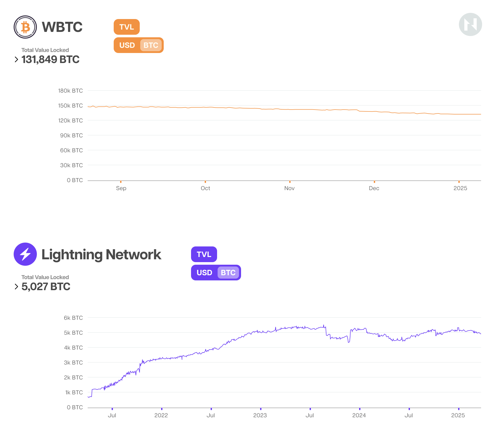

People would much rather accept the security trade-offs from using other blockchains to use BTC for things other than spending it, like using it as collateral on decentralized money markets or earning transaction fees for providing liquidity on [automated market makers](https://www.gemini.com/cryptopedia/amm-what-are-automated-market-makers).

After close consideration, it makes total sense that people would want to use the most decentralized and secure blockchain for things other than spending one of the best-performing assets over the last decade.

However, for some reason, most of the Bitcoin community’s scaling efforts have been precisely in the opposite direction. Most of its energy went into fighting over the best ways to scale Bitcoin’s throughput (see the [Blocksize Wars](https://www.bitstamp.net/learn/crypto-101/what-was-the-blocksize-war/)) and developing and promoting Lightning with relatively little success. Only recently, perhaps over the last three years, did the attention shift towards expanding Bitcoin’s programmability.

## Not All Bitcoin Layer 2s Are Created Equal

Before exploring the differences and trade-offs associated with the most recent Bitcoin scaling efforts, it’s worth noting that most of these projects market themselves as “Bitcoin Layer 2s,” a highly contentious and even misleading term.

Generally speaking, Layer 1 chains are sovereign blockchains with their own consensus mechanisms and security budgets that can function independently without relying on any other chain for consensus, data availability, or execution. On the other hand, the most widely accepted definition for “Layer 2” is a protocol that extends the throughput and/or programmability capabilities of another underlying chain while inheriting its security guarantees. 

In the context of Bitcoin, a more suitable Layer 2 definition would be a protocol that takes transaction execution off-chain and enables any user to ensure the integrity of the two-way peg.

Insofar as what we have on mainnet today, most Bitcoin scaling projects besides the Lightning Network fail this test. They fall under other categories, like infrastructure (wBTC, tBTC, Babylon, etc.) and sidechains (Rootstock, Stacks, Liquid, Bob, BEVM, etc.). Sidechains are essentially sovereign blockchains that connect to Bitcoin via bridges or two-way pegs (in most cases, federated multi-sigs), allowing users to bridge their BTC to another smart contract-enabled or more performant environment. 

To that point, even the term “[bridge](https://www.nervos.org/knowledge-base/what_are_blockchain_bridges_%28explainCKBot%29),” widely used by most cross-chain interoperability solutions today, is a misnomer. Bridges that literally transport native assets to other chains don’t actually exist. Instead, two-way pegs employ a burn or lock-mint operational logic where the BTC is locked inside a multi-sig on the Bitcoin network, and a corresponding synthetic asset is minted on the adjacent chain. 

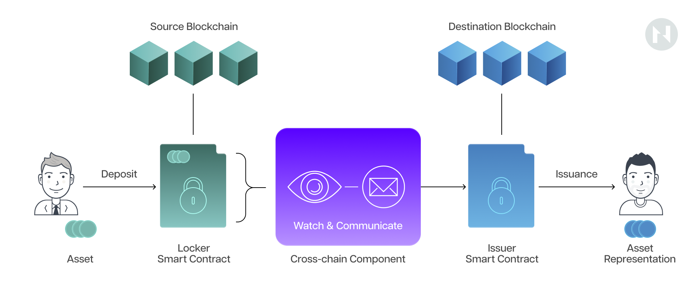

Theoretically, this synthetic asset can always be redeemed one-to-one for the native BTC locked on the Bitcoin network. However, these are undeniably distinct assets; if the BTC locked on the Bitcoin network somehow disappeared, the synthetic asset representing that BTC on Layer 2 would continue to exist.

A deeper analysis of each Bitcoin scaling category reveals a variety of unique trade-offs. Namely, as already noted, sidechains are not Layer 2s, meaning they don’t inherit Bitcoin’s unmatched security. They rely on custodial two-way pegs, which centralize and introduce unique security risks independently.

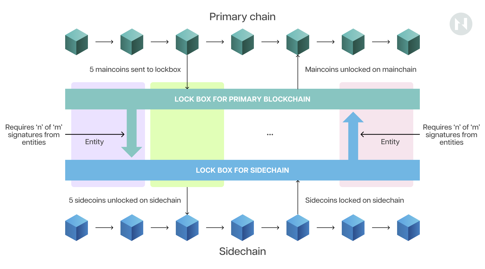

*Federated two-way peg*

Moreover, current sidechains have more of a parasitical than a symbiotic relationship with Bitcoin. They siphon away liquidity without giving anything back. This is a notable issue because [Bitcoin’s long-term security](https://www.nervos.org/knowledge-base/bitcoin_and_ckb_security_models) is contingent on miners earning increasingly more revenue from transaction fees, as the coinbase block reward halves every four years. In the case of sidechains, the transaction fees go to the sidechain block builders or sequencers, while the Bitcoin miners get nothing.

Actual Layer 2 solutions like the Lightning Network have a more symbiotic relationship with Bitcoin because the transaction fees for opening and closing the payment channels ultimately go to the miners. However, these don’t support smart contracts, which significantly hinders their user adoption. 

The more unorthodox asset issuance protocols on Bitcoin, like inscriptions, which many wouldn’t even consider a scaling solution, benefit miners by increasing block space demand and ultimately miner revenue but lead to other issues. Namely, users must rely on third-party indexers to track Ordinals or inscriptions, which introduces an additional element of trust and centralization to the mix.

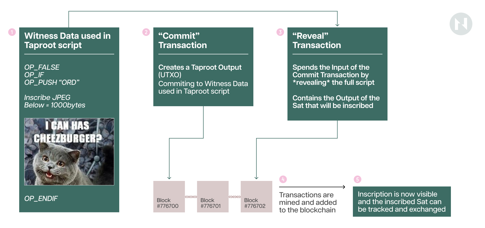

Furthermore, inscriptions leave a significant footprint, “artificially” pushing the size of Bitcoin blocks to the hard-capped limit of 4MB, which increases the long-term storage burden on full nodes. To that point, inscription-based asset issuance protocols like [BRC-20](https://www.coinbase.com/learn/crypto-glossary/what-are-brc-20-tokens) have generated a large number of useless dust satoshis (the size is typically 546 or 330 satoshis), resulting in the irreversible expansion of the UTXO set. 

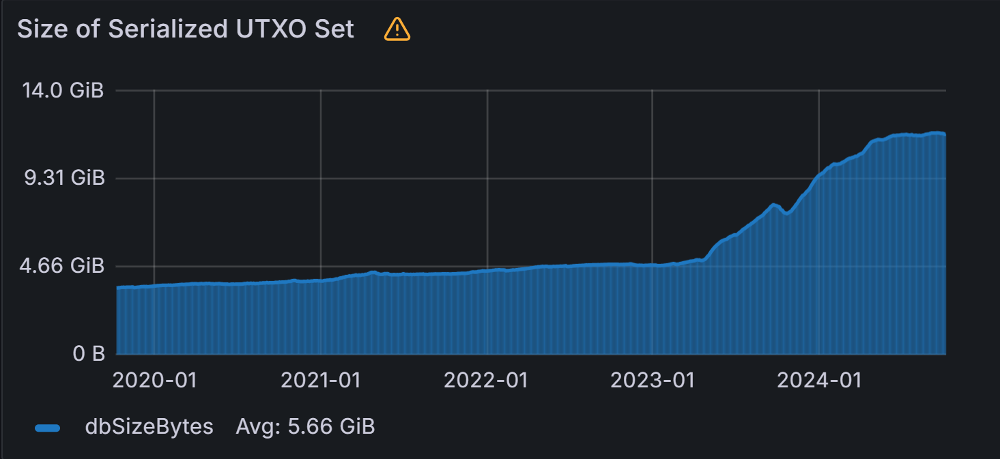

As seen in the above chart, the start of the abnormal rapid expansion of the Bitcoin UTXO set perfectly coincides with the launch of the BRC-20 protocol in March 2023. Since then, the UTXO set has more than doubled, growing from around 5 GB to 12 GB. This is one of the most criticized aspects of the BRC20 asset issuance protocol—it wastes node resources. 

But what if there was a way to scale and extend Bitcoin’s programmability without making all these trade-offs? 

**Enter RGB++.**

## The Case for RGB++

[RGB++](https://www.rgbppfans.com/) is a novel scaling solution that provides Bitcoin with Turing-complete programmability while fully leveraging its decentralization and security guarantees. It’s a genuinely “Bitcoin native” scaling solution that fully aligns and integrates with Bitcoin’s UTXO model. 

*Design overview of the RGB protocol. (Source: [RGB blackpaper](https://black-paper.rgb.tech/general-information/2.-protocol-design/2.2.-design-overview)).*

RGB++ is heavily inspired by the [RGB](https://black-paper.rgb.tech/) protocol, which completely reimagines the ledger-based blockchain approach. RGB introduced two novel primitives, [single-use seals](https://black-paper.rgb.tech/consensus-layer/3.-client-side-validation/3.2.-single-use-seals) and [client-side validation](https://black-paper.rgb.tech/consensus-layer/3.-client-side-validation), to scale and extend Bitcoin’s programmability by taking all computation off-chain. 

However, despite its innovative design, RGB has proven to be an imperfect solution.

Namely, due to the inherent limitations of client-side validation, RGB users must be online to transact and must figure out a way to back up the transaction and smart contract data locally, which significantly diminishes the user experience. 

Moreover, RGB contracts are immutable, which means that once they are deployed, they can’t be changed. This can be both good and bad, but the main drawback is that RGB dApps can’t evolve to keep up with their competitors. Furthermore, RGB lacks a good interactive solution for ownerless (public) contracts, making building proper decentralized applications like those on EVM chains difficult.

To avoid these issues, the RGB++ protocol borrows the concept of single-use seals from RGB to manage the ownership aspect of assets but somewhat abandons client-side validation and instead uses [Common Knowledge Base (CKB)](https://www.nervos.org/knowledge-base/nervos_overview_of_a_layered_blockchain), a UTXO-based Turing-complete blockchain, to handle state changes and transaction verification.

The key innovation or technique RGB++ introduces is called “isomorphic binding.” 

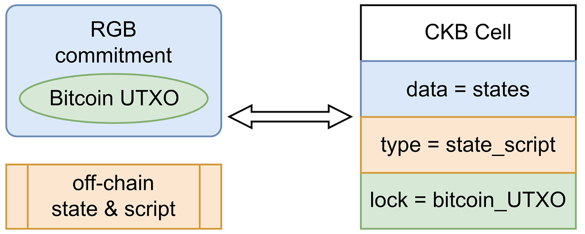

To break it down, *isomorphism* is a mathematical term that refers to a mapping between two structures that shows a one-to-one correspondence between their elements while preserving their operations and relations. 

When two structures are isomorphic, they are structurally identical in terms of their relationships and operations, even if the elements themselves are different.  

*Binding* in computer science refers to the association of two entities, such as variables to values, names to entities, or interfaces to implementations. Isomorphic binding combines these concepts and allows structures to be bound together across two different systems in a way that their fundamental structures are preserved.

In the context of RGB++, *isomorphic binding* refers to mapping a dust satoshi (Bitcoin UTXO) to a CKB Cell (eUTXO). CKB’s Cells are flexible and abstract data structures capable of storing data and executing scripts, acting like programmable containers for value and state information. Bitcoin’s UTXOs, on the other hand, serve as *single-use seals* that define the asset’s ownership. By binding each UTXO to a specific Cell, RGB++ ensures that ownership and state changes are mirrored on both blockchains, maintaining a consistent and synchronized state. 

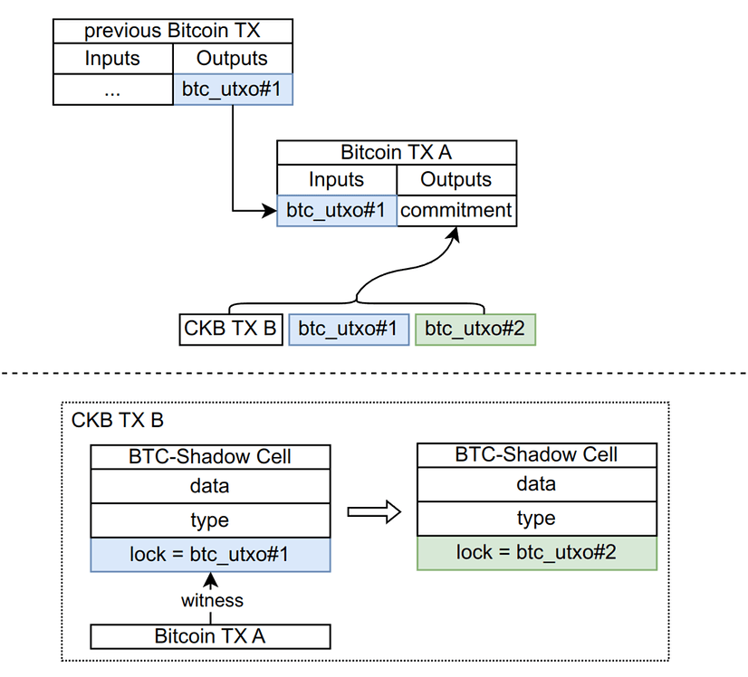

Whoever can spend the UTXO on Bitcoin also owns and controls the corresponding RGB++ assets. The process resembles a shadow moving along when a body moves; whenever the original UTXO is spent, the corresponding Cell or RGB++ asset is also transferred.

The idea behind this technique is to extend Bitcoin’s smart contracting capabilities and enable asset issuance on Bitcoin without needing any protocol-level updates or forks and making any trade-offs in security.

The RGB++ protocol achieves this by defining the business logic of the assets or dApps using the Cell’s data and type scripts and the ownership using Bitcoin’s lock script. More specifically, the unlocking or spending conditions of the CKB Cells carrying or defining the programmable RGB++ assets are set to the corresponding Bitcoin UTXOs being spent.

In simple terms, this effectively means that RGB++ assets enjoy the same security as BTC on Bitcoin, as double-spending an RGB++ asset, for example, would require a successful Bitcoin [reorg](https://learnmeabitcoin.com/technical/blockchain/chain-reorganization/). Moreover, since the ownership of RGB++ assets is defined by Bitcoin UTXOs, users can interact with RGB++ dApps and assets with their Bitcoin wallets without any other infrastructure or clients being required.

Now that we’ve explained how RGB++ and isomorphic binding work, let's look at the benefits or features that make them unique. These can be summed up into three categories: RGB++ is (i) Bitcoin’s native asset issuance layer, (ii) the smart contract layer, and (iii) the interoperability layer of the entire UTXO ecosystem. 

### RGB++: The Bitcoin Asset Issuance Layer

The RGB++ protocol supports the issuance of various assets, including so-called [User-Defined Tokens (UDT)](https://docs.nervos.org/docs/dapp/create-token), which are comparable to ERC-20 tokens on Ethereum, and [Digital Objects (DOBs)](https://docs.nervos.org/docs/dapp/create-dob), which are analogous to NFTs or ERC-721 tokens. 

However, unlike in Ethereum and other account-based blockchains, where tokens are second-class citizens defined and held by smart contracts, UDT and DOB assets are defined and held on the CKB blockchain in Cells, which are effectively Turing-complete UTXOs. This means they are first-class citizens on CKB like ETH on Ethereum or BTC on Bitcoin—owned and directly controlled by the users, not EOA-controlled smart contracts.

As opposed to existing inscription-based assets on Bitcoin, UDTs are programmable and don’t rely on centralized indexers, making them more decentralized. To understand them better, it’s worth looking at their containers, the CKB Cells.

[Cells](https://docs.nervos.org/docs/tech-explanation/cell-model) contain three fields: data, type script, and lock script. The data field stores the balance of the UDT in the first 16 bytes; the type script defines the UDT's operational logic, effectively serving as a smart contract; and the lock script defines the asset’s ownership, ensuring only its owner can spend the UDT.

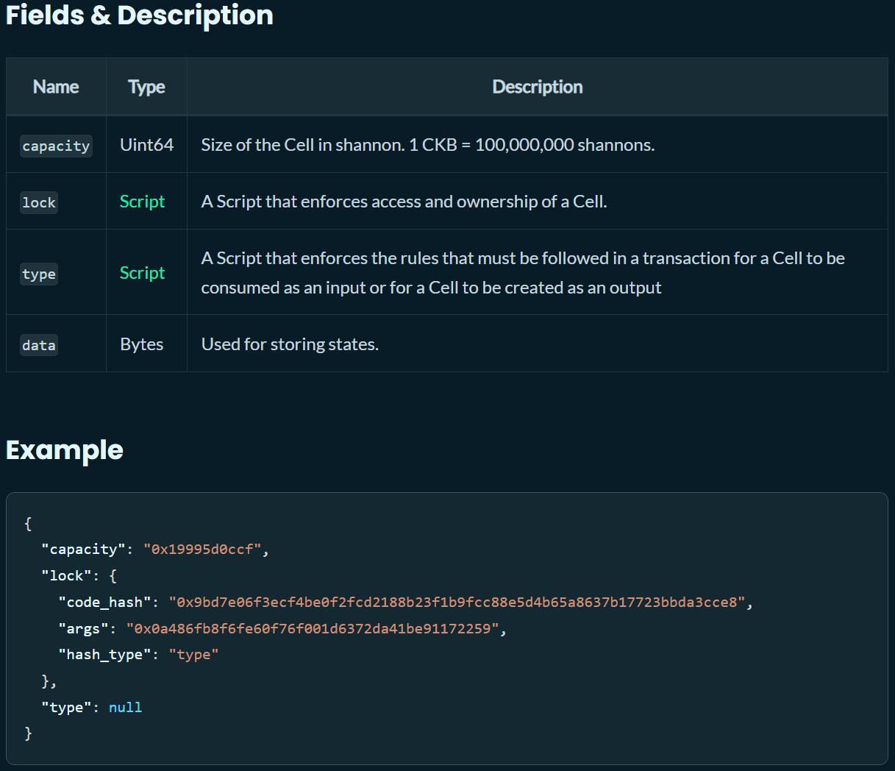

The cool thing about the lock script of Cells is that they’re user-defined, meaning the ownership aspect of the UDT is decoupled from the UDT itself. Therefore, the unlocking or spending conditions can be set to, for example, the spending of a Bitcoin UTXO. In fact, this is what RGB++ does with isomorphic binding: it sets the lock script conditions to the spending of a Bitcoin UTXO, thereby effectively transferring the UDT’s ownership over to the Bitcoin Layer 1. 

*Consequently, the UDT can be considered an asset on Bitcoin because a Bitcoin UTXO controls its ownership.*

#### RGB++ Assets Leave No Footprint

RGB++ assets are superior to inscription-based assets like BRC-20 or SRC-20 because they leave no on-chain footprint. Namely, an inscription involves attaching a JSON snippet to the Witness portion of a specific satoshi. Once a recipient receives the inscribed satoshi, which corresponds to or represents a BRC-20 asset, that satoshi becomes useless. This is because transferring a BRC-20 asset to another recipient requires creating or inscribing an entirely new satoshi, which is sent to the next recipient. 

Every time a specific BRC-20 asset is transferred from one Bitcoin user to another, a new satoshi that remains unspent must be created. As previously mentioned, this process creates significant state bloat by permanently inflating the UTXO set, thereby putting additional and permanent resource pressure on nodes. Inscription-based assets, therefore, effectively resemble a dust attack on the Bitcoin network, hurting its long-term decentralization.

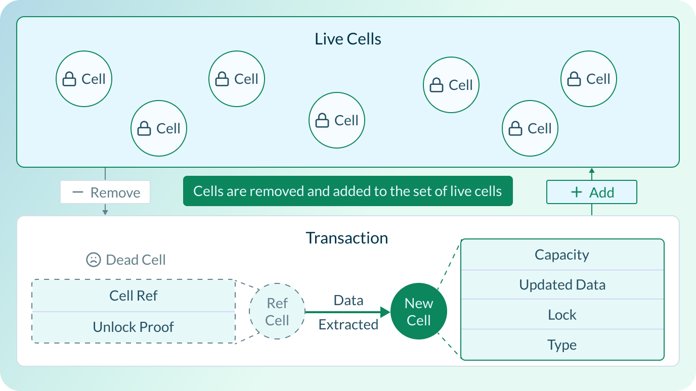

Conversely, in the RGB++ protocol, the dust satoshis act as the keys to the ownership of the RGB++ assets. This means that every time an RGB++ asset is transferred, the corresponding satoshi is spent or destroyed, meaning it doesn’t irreversibly inflate the Bitcoin UTXO set.

#### Scaling Bitcoin’s Throughput

*A graphic description of the transaction folding process in RGB++.*

Besides extending Bitcoin’s programmability, the RGB++ protocol can also greatly enhance Bitcoin’s scalability by providing a high-throughput Layer 2 network for Bitcoin-native assets. It does this through a technique called “transaction folding,” which involves batching many RGB++ transactions before sending a summary commitment to Bitcoin. The approach, similar to rollups, saves a significant amount of fees and significantly improves the transaction throughput. 

### RGB++: The Bitcoin Programmability Layer

RGB++ allows Bitcoin to leverage the full smart contract stack of the CKB blockchain—or any other programmable UTXO-based smart contract platform, for that matter—unlocking a whole new domain of Bitcoin-native DeFi applications.

One example is [UTXOSwap](https://utxoswap.gitbook.io/en), an intent-based decentralized exchange for UTXO-based chain assets. Because UTXO transactions are declarative (as opposed to the imperative nature of account-based blockchain transactions), UTXOSwap users can express their intents directly on-chain, which offers numerous benefits over traditional order books or AMM-based decentralized exchanges.

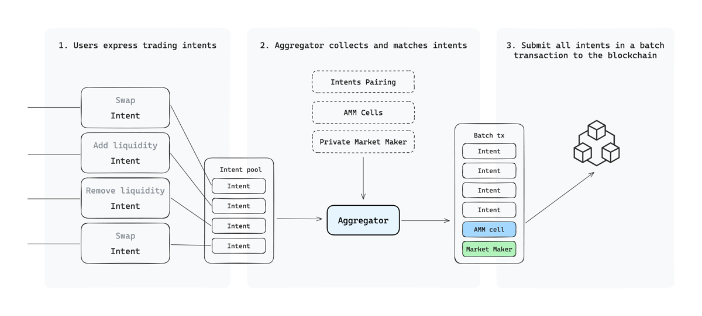

UTXOSwap implements an off-chain matching and on-chain verification process, leveraging the UTXO model's parallelism to improve transaction efficiency. Its intent-based design allows it to support limit orders and TWAP transactions, meaning users can declaratively express their trading intents, i.e., "exchange 0.2 BTC for at least 560 X tokens," instead of simply initiating a swap transaction and passively accepting the market price along with the slippage and MEV that come with it.

Making swaps on UTXOSwap primarily involves the following three steps:

* **Intent Expression:** Users express their transaction intent by signing a message that includes the asset type, amount, and other parameters.
* **Aggregation and Matching: **The aggregator collects all user intents, explores on-chain and off-chain liquidity sources, including directly matched user intents, private market makers, and AMM Cells (various AMM liquidity pools built on CKB), and performs intent matching.
* **Transaction Submission:** The aggregator assembles all eligible transactions and submits them on-chain.

Another example of a Bitcoin-native dApp is [Stable++](https://stablepp.gitbook.io/stable++), a decentralized, over-collateralized stablecoin that uses BTC and CKB as collateral to mint the first stablecoin in the RGB++ ecosystem, $RUSD.

Leveraging CKB’s smart contracting capabilities, Stable++ can build over-collateralized vaults and efficient liquidation modules, ensuring a robust and secure Bitcoin-native stablecoin ecosystem. Like all other UDTs, this stablecoin can be used freely across all UTXO-based chains without relying on custodial bridges or cross-chain messaging protocols—which brings us to the next point.

## RGB++: Unbounded Interoperability Between All UTXO Chains

What makes RGB++ truly remarkable and stand out from all other Bitcoin scaling solutions is its ability to connect all UTXO-based chains without any bridges. This means that various assets from chains like Bitcoin, Cardano, Dogecoin, Bitcoin Cash, Ergo, etc., can be seamlessly integrated into a single, universal interoperability layer of the UTXO ecosystem.

This is possible due to the protocol’s unparalleled interoperability feature, the [Bridgeless Cross-Chain Leap](https://medium.com/@utxostack/the-magic-of-rgb-bridgeless-cross-chain-leap-70ed82bed3ab). It works by applying the same isomorphic binding technique, which works by setting the lock script conditions of RGB++ assets to a Bitcoin UTXO and the UTXOs of other chains.

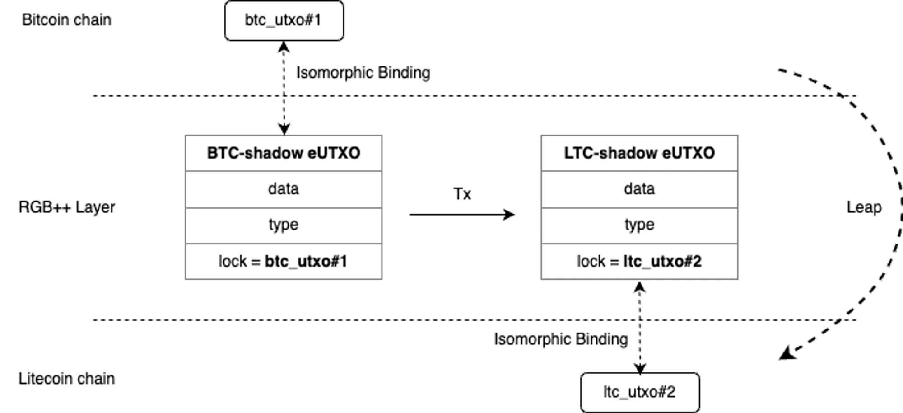

For example, a user can seamlessly transfer an RGB++ asset, say 1,000 RUSD stablecoins from Bitcoin to the Cardano or the Litecoin chain, by first spending the Bitcoin UTXO bound to the corresponding RGB++ asset and then constructing another transaction that changes the unlocking condition of the asset to a Litecoin UTXO. From that point forward, transferring the RUSD tokens would require spending a Litecoin UTXO, meaning that the ownership of the tokens has effectively been transferred to the Litecoin chain.

The possibilities the Leap feature unlocks are endless. A user could, for example, exchange A token on Bitcoin for B token on Cardano through a decentralized exchange like UTXOSwap without any bridges. They could use a DOB on the CKB chain to subscribe to a service on Nostr and more. The entire process is bridgeless and fully decentralized without introducing unnecessary trust assumptions like federated multi-sigs.

## Conclusion

In a landscape where existing scaling efforts often involve significant trade-offs—be it in security, decentralization, or usability—RGB++ offers a holistic solution that aligns with Bitcoin's original ethos.

It provides a path forward that addresses the evolving needs of users who desire more than just a store of value asset or a high-throughput payment network. By unlocking new possibilities for decentralized applications, financial instruments, and bridgeless cross-chain interactions, RGB++ is positioned as a novel, sustainable avenue for Bitcoin's next growth phase.

Isomorphic binding allows RGB++ to bridge the gap between Bitcoin's unparalleled security and the need for more advanced smart contract capabilities without requiring trust in third-party indexers or custodial bridges, setting the protocol apart from other so-called Layer 2s.

Furthermore, RGB++’s ability to facilitate asset issuance on Bitcoin without leaving an on-chain footprint solves the state bloat problem caused by inscriptions-based assets. Transaction folding, conversely, significantly boosts Bitcoin’s scalability, allowing RGB++ to effectively serve as a high-throughput rollup for programmable assets.

Most importantly, RGB++ isn’t a theoretical solution—a proof of concept or an overhyped whitepaper with an uncertain future. RGB++ is already live on mainnet and growing in both users and dApps.
