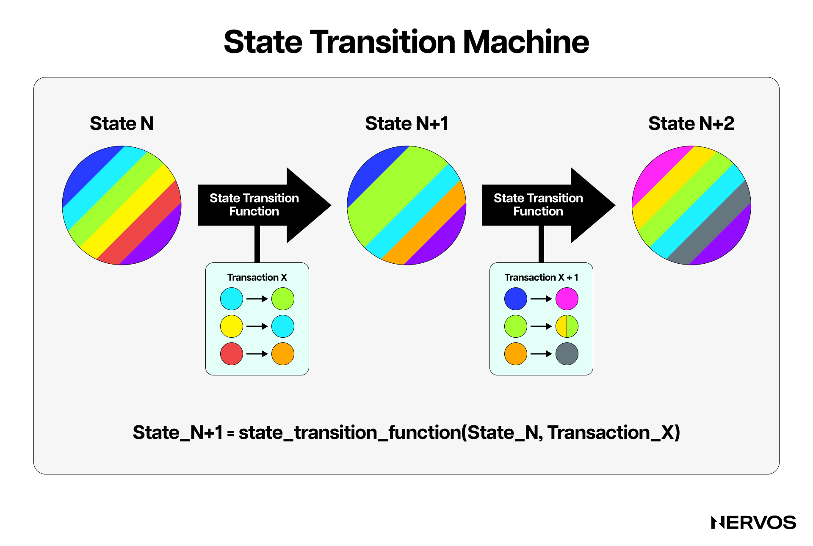
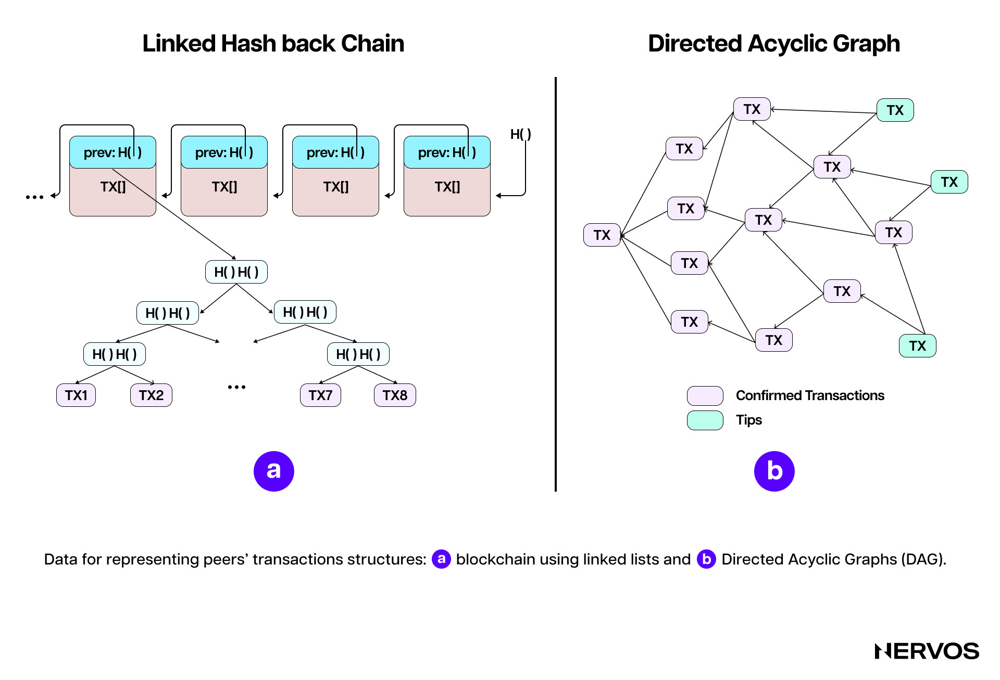
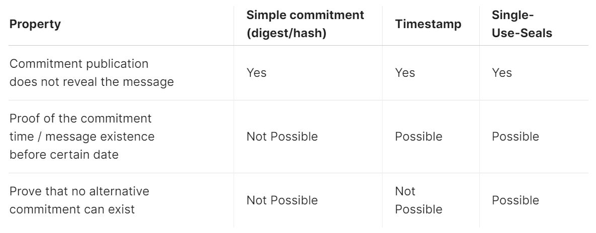
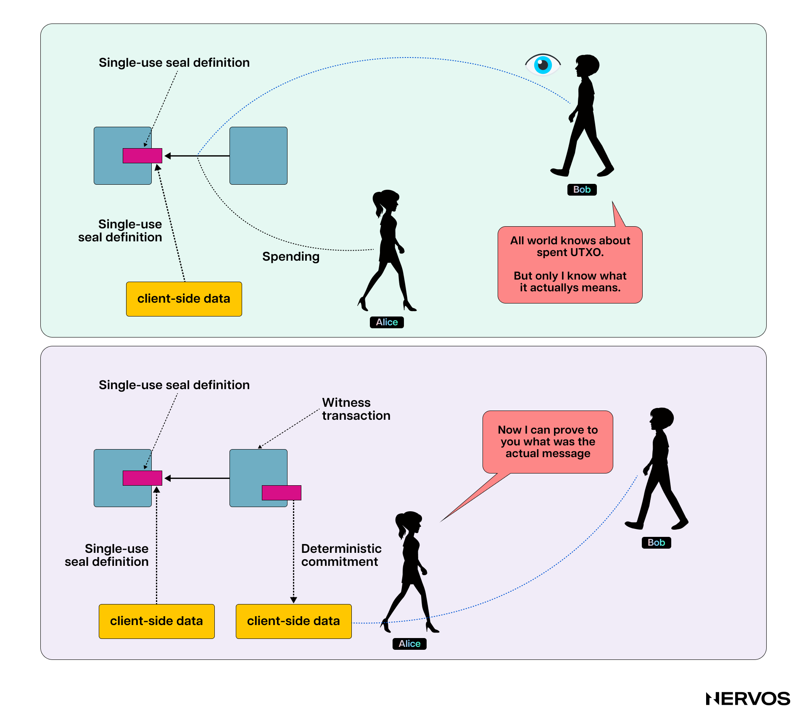
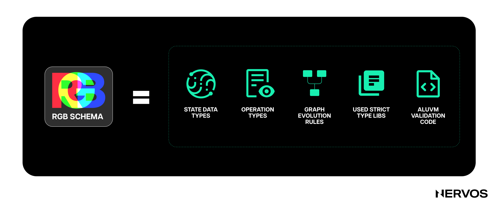

The rise in popularity of ordinals, inscriptions, and BRC-20 tokens over the last two years has made it abundantly clear that crypto users want tokenized assets on Bitcoin. 

Ethereum's smart contract ecosystem has achieved massive success, but Bitcoin remains the most popular, secure, and decentralized blockchain. This fact makes issuing tokenized assets on Bitcoin ever more appealing. However, the desire to keep the base layer simple, by moving complex computational logic off-chain, along with a cultural tendency towards base layer ossification, has made it increasingly difficult for projects to issue assets using Bitcoin.

In fact, [inscriptions](https://www.nervos.org/knowledge-base/guide_to_inscriptions)—the most recent attempt to issue assets on Bitcoin—only go to show this. They work by injecting an arbitrary blob of data into the SegWit witness field using Taproot spend scripts, which were never intended to be used this way. 

Inscriptions leave a significant on-chain footprint, making operating a Bitcoin node more resource-intensive, potentially hurting Bitcoin's decentralization and scaling efforts. Simply put, inscriptions are not the end-all-be-all solution to smart contracts and asset tokenization on Bitcoin, but instead a sloppily hacked and slapped-together workaround to a prevailing problem.

Perhaps the most popular among Bitcoin’s proposed scalability solutions are sidechains. They somewhat solve Bitcoin’s lack of programmability but still inherit most of blockchain technology’s limitations, while introducing additional centralization and security risks—a tradeoff that Bitcoiners aren’t too eager to accept. Needless to say, sidechains aren’t the ideal solution to smart contracts and asset tokenization on Bitcoin, either.

Luckily, despite being a far from perfect solution, the recent hype surrounding Ordinals and inscriptions has inadvertently highlighted an older asset tokenization solution on Bitcoin called RGB. Originally standing for Red, Green, and Blue—a homage to Bitcoin’s [colored coins](https://en.bitcoin.it/wiki/Colored_Coins) that inspired it—and later changed to mean “Really Good Bitcoin”, RGB is an asset tokenization project over the [Lightning Network](https://www.nervos.org/knowledge-base/ultimate_guide_to_payment_channels) that completely reimagines blockchain scaling.

## A Radically Different Approach

Conceived in 2016 and currently in the final stages of development, [RGB](https://rgb.tech/) is based on research by Bitcoin Core developer Peter Todd, which Bitcoin entrepreneur and educator Giacomo Zucco later adapted, and developer Dr. Maxim Orlovsky carried on the work of. Before delving under its hood, it’s worth highlighting how RGB takes a philosophically different approach to scaling Bitcoin and blockchains in general.

Namely, the original implementation of Bitcoin, as conceived by Satoshi Nakamoto, partway ossified the idea in every crypto pundit’s mind that all state transitions—or, in Bitcoin’s case, transactions—must be verified by all nodes in a distributed network. The “don’t trust, verify” idea is at the heart of this implementation, where none of the network participants have to rely on anyone else to get to the facts about the true state of the ledger and can, at any time, inspect and see the whole of the ledger.

While this implementation certainly has many merits, it has two major downsides: difficulty scaling and poor privacy. The former hinders mass adoption, while the latter contradicts Bitcoin’s original cypherpunk ethos and puts users’ livelihoods and potentially even lives at risk. To solve these two problems and imbue Bitcoin with better programmability, RGB adopts a radically different view of the role of a blockchain.

Distributed protocols, like Bitcoin or other smart contract platforms, must synchronize across all network nodes. The blockchain is organized into atomic transactions or, more generally, state transitions. The sequence of how these state transitions are applied to the initial (genesis) state must be clearly defined to achieve synchronicity across the network. This is done via a so-called consensus rule or mechanism.

In this sense, a “blockchain” is a specific form utilized by distributed protocols (initially Bitcoin) that leverages a consensus mechanism to organize transactions or state transitions into a time-ordered chain (i.e., a sequence) named a ledger. Therefore, it can be said that a blockchain conceptually consists of two parts: a consensus mechanism (Proof-of-Work Nakamoto Consensus, in Bitcoin’s case) and a transaction ledger whose ordering and finality are governed by that consensus mechanism.

Now, Peter Todd and the developers behind RGB believe that most of the scalability and privacy issues in blockchains result from their having a public ledger. They argue that the main concern of distributed systems like Bitcoin should be reaching consensus on event ordering—not the data of the events themselves.

To that point, RGB completely reimagines the ledger-based blockchain approach by leaning into *client-side validation*. In this approach, all the transactions or state transitions are validated off-chain or locally by the concerned parties, and the Bitcoin base chain is used only for the one task that blockchains excel at: consensus.

*The layout of the RGB architecture. (Source: [blackpaper.rgb.tech](https://blackpaper.rgb.tech/general-information/2.-protocol-design/2.2.-design-overview))*

In RGB, the ledger or transaction data isn’t recorded on a public blockchain or validated by Bitcoin nodes, but rather is validated and stored off-chain by the concerned parties or the state owners. The base or consensus layer keeps only a short cryptographic commitment to the ledger event to be timestamped, serving as an anti-double-spending measure. This approach significantly improves both scalability by reducing the size of the on-chain data and privacy by moving the actual ledger of transactions away from the view of all network participants.

## How RGB and Client-Side Validation Works

Client-side validation is based on the idea that the only thing that matters to a transaction recipient is the directed acyclic graph (DAG) connecting the history of the state transitions from the genesis state to the last state addressed to them—not the whole history of the entire ledger.

The idea is that when Bob wants to send Alice bitcoin on the Bitcoin network, he signs a transaction and broadcasts it to the entire network. Then, miners pick up this transaction from the mempool, check whether it's valid, and include it in a block. All the blocks are valid only if the transactions within them are valid. 

In contrast, when Bob wants to send Alice a token on RGB, he signs a transaction, and instead of broadcasting the transaction to the entire Bitcoin network, he sends it only to Alice, generates a *commitment* to this transaction, and broadcasts the *commitment* to the network. In this case, Alice will be the only one who verifies the transaction's validity by ensuring it matches the on-chain commitment.

Now, suppose Alice wants to send David this token. In that case, she will pass to Dave Bob's signature on the previous commitment, as well as her signature to the commitment sending the token to David, and post a commitment to this transaction to the Bitcoin network. If David wants to ensure that the transaction he received from Alice is valid, he must check the entire sequence (Bob to Alice, Alice to David) against their respective commitments, and so on.

 \
*Several shards can be aggregated in a single Layer 1 transaction. The Anchor structure establishes a link between the contract's client-side data and the single-use seal. (Source: [docs.rgb.info](https://docs.rgb.info/distributed-computing-concepts/client-side-validation))*

For the uninitiated, a commitment is a cryptographic primitive representing a digital promise that can’t be changed once made. It’s used to keep information secret while allowing it to be revealed and verified by a third party later. Commitments have two main properties: (i) hiding, meaning they’re used to conceal data, and (ii) binding, meaning that once a commitment has been made, it can’t be tampered with without detection. One can also think of a commitment as sealing a message in an envelope: Bob can show the sealed envelope to Alice to prove that they have a message inside, but Alice can’t see it until Bob reveals it.

To better understand how commitments are used in RGB, consider the following real-world example: Suppose Bob creates a smart contract for a decentralized loan. The contract's state includes information like the loan amount (1 BTC), collateral required ($80,000 in stablecoins), interest rate (5%), and the borrower's details (Alice). 

To create a commitment, Bob hashes the smart contract state data and includes the hash in a Bitcoin transaction (Tx1). Then, Bob funds the smart contract with 1 BTC, creates a new hash for the updated smart contract state, posts the commitment to Bitcoin (Tx2), and sends the full smart contract data to Alice. After Alice deposits $80,000 in stablecoin tokens to the contract, the smart contract state is updated to reflect this deposit. Alice hashes this new state and posts the commitment to Bitcoin (Tx3). The smart contract automatically sends the 1 BTC to Alice upon receiving the collateral. Then, when Alice repays 1.05 BTC (1 BTC + 5% interest) to the smart contract, its state is updated to reflect the payment. Alice then hashes this new state and posts the commitment to Bitcoin (Tx4). Upon verifying the repayment, the smart contract automatically releases Alice's $80,000 in stablecoin collateral for the loan. Alice then hashes the final state of the smart contract and posts the commitment to Bitcoin (Tx5).

Unlike with traditional decentralized market makers on Ethereum, nobody besides Alice and Bob can see the details of their loan agreement on RGB. Nobody knows that Bob gave Alice a loan, how much the loan amount was, or how much interest he charged. Most importantly, this level of privacy ensures that nobody can front-run and liquidate Alice when her loan-to-value ratio approaches the liquidation threshold, as it often happens on Ethereum.

In RGB, all of the smart contract data is kept locally by Alice and Bob, and the Bitcoin miners only validate the transactions that contain the commitments, not the transactions between Alice and Bob themselves. Beyond the obvious privacy benefits, this significantly improves Bitcoin’s scalability, as the size of a single commitment—which can bundle more than one state transition of the same asset in the same client-side operation or aggregate state transition of different contracts into a single commitment—which is only 32 bytes (and can be compressed even more). In contrast, Bitcoin transactions with multiple inputs and outputs can range from several hundred to several thousand bytes, meaning less of them can be contained inside a block, limiting the total transaction throughput of the network.

### What Are Single-Use Seals?

With the groundwork laid out above, we can introduce the second core technology in RGB that works in conjunction with client-side validation: *[single-use seals](https://docs.rgb.info/distributed-computing-concepts/single-use-seals)*. First proposed by Peter Todd in 2016, single-use seals are cryptographic primitives designed to ensure that a specific action or commitment can only be used once. They are analogous to tamper-evident physical seals, which cannot be reused once used.

In the context of RGB and Bitcoin, single-use seals and client-side validation work together to ensure data integrity and security. The whole process works in the following way: Suppose Alice has a Bitcoin UTXO linked to some client-side validated data, which only she knows. She informs Bob that spending this UTXOs signifies some event or action.

When Alice spends the UTXO, everyone on the Bitcoin blockchain can see this transaction, but only Bob understands its unique significance. This spending event changes the validated data on Alice's side. By sending the original data to Bob, she can prove that the data referenced by the UTXO commitment is valid because, using the appropriate methods that are part of the client-side validation protocol (e.g., RGB), Bob can verify this data independently.

*The key point of using single-use seals is to securely link data to Bitcoin transactions, which cannot be tampered with once recorded on the blockchain. *

When Alice spends a Bitcoin UTXO, she commits to certain data. This commitment is publicly verifiable, but only meaningful to specific parties like Bob, who understands its context. The system ensures that once Alice commits to something, it can't be changed later. This mechanism provides a reliable, decentralized way to validate and record important data without needing a central authority.

### Smart Contracts and Asset Tokenization in RGB

Using these two primitives, client-side validation and single-use seals, RGB allows developers and users to build complex decentralized applications and issue tokenized assets on top of Bitcoin.

However, how these smart contracts and tokenized assets work differs significantly from how they do on popular smart contract platforms like Ethereum. Namely, an RGB asset is always allocated to a Bitcoin UTXO (which has the role of a single-use seal in the protocol). For the asset to be transferred to a new owner, the corresponding UTXO must be spent. This means that a Bitcoin transaction is created with that UTXO as an input, and the off-chain RGB transfer data will define a UTXO for the asset’s new owner. 

Regarding RGB smart contracts, each is represented by a genesis state created by a *smart contract issuer*, and a DAG of the contract’s state transitions is kept off-chain in the form of client-validated data. The state is assigned to a Bitcoin UTXO (single-use seals), and the party that can spend the corresponding UTXO is named a *state owner*. The issuer can change the corresponding part of the smart contract state by creating a new state transition and committing to it in a transaction that spends the UTXO containing the previous state.

The asset or smart contract issuer in RGB must define the rules of available contract operation or its business logic in the Genesis state using a so-called [Schema](https://docs.rgb.info/rgb-contract-implementation/schema). In simple terms, a Schema is a declarative piece of code that contains the set of variables, rules, and business logic according to which an RGB contract works. Thus, when a RGB user receives some information about an asset on RGB (data and contract), they must validate it against the Schema distributed by the asset issuer. 

This architectural choice distinguishes RGB contracts from blockchain-based contracts like those implemented on Ethereum. In the latter systems, the contracts are provided as executable code, and the rules governing the contract’s business logic are directly stored on the blockchain. 

In contrast, because the RGB network does not have a specific public chain as a carrier and only uses Bitcoin, the Lightning Network, or other blockchains for consensus/double-spend insurance, the contracts are encoded in a purely declarative way, and the RGB clients must validate them locally against the off-chain Schema which provides the contract’s business logic. In fact, Schema validation is the very first operational step that a user must take before interacting in any way with the contract (e.g., performing the desired contract operations).

Furthermore, RGB operates in “shards,” where every contract has a separate state history and data, meaning different smart contracts never directly intersect in their histories. The main advantage of this design is that RGB nodes don’t need to obtain the entire block data; they only need the DAG corresponding to the specific contract to verify its state. And since each smart contract and its state transitions correspond to certain Bitcoin UTXOs, it’s easy to trace the current smart contract state back to the initial Genesis state to verify it.

To ensure deterministic smart contract execution, RGB utilizes [AluVM](https://www.aluvm.org/) (algorithmic logic unit VM)—a highly deterministic functional virtual machine providing a platform-independent instruction set. It’s a purely functional RISC virtual machine designed for deterministic portable computing tasks. Unlike other blockchain VMs, like WASM or EVM, which are stack-based, AluVM is register-based and does not allow random memory access, making it perfectly suited for smart contract and remote code execution.

In summary, as a smart contract platform, RGB significantly differs from previous Bitcoin-based approaches like Colored coins, [Counterparty](https://en.wikipedia.org/wiki/Counterparty_(platform)), or [OMNI](https://www.omnilayer.org/), and non-Bitcoin ones like Ethereum, Solana, NEAR, Cosmos, etc. Namely, RGB separates the concept of smart contract *issuer*, state *owner*, and state *evolution*. It keeps the smart contract code and data off-chain, uses the Bitcoin blockchain only as a state commitment layer, uses the Bitcoin script as an asset or state ownership control system, and defines smart contracts’ evolution or business logic via an off-chain Schema. 

### RGB’s Capabilities

The two biggest benefits of RGB’s reliance on client-side validation are privacy and censorship resistance. By keeping all transaction data and smart contract code, RGB offers a level of privacy that can’t be found in any other blockchain or Bitcoin scaling solution. This means that users can issue assets and digital identities and interact with various DeFi protocols without broadcasting their trades or positions to the entire Bitcoin network. Moreover, this also means that Bitcoin miners can’t censor RGB transactions, and searchers can’t extract any [MEV](https://cryptobriefing.com/what-is-mev-ethereums-invisible-tax-explained/) from them.

Finally, as an off-chain smart contract system, RGB doesn’t require a native token to operate and can be implemented on top of any Layer 2 protocol, such as the Lightning Network or sidechains. Compared to liquidity pool-based decentralized exchanges, RGB dApps on the Lightning Network offer lower latency, lower fees, more privacy, no risk of front-running by miners or MEV bots, and certainty on the execution price—all elements that contribute to a much better user experience for crypto users.

### RGB’s Drawbacks

While RGB is an excellent addition to the slew of projects looking to scale and extend Bitcoin's programmability, it's far from a perfect solution.

One of the key drawbacks of client-side-validation-based protocols is that the parties must be online to transact. The parties must continuously exchange proofs to transact, meaning they both must be online simultaneously to receive the proof peer-to-peer. Moreover, since all RGB transaction and smart contract data is stored by the users locally, it's up to them to figure out a way to back up this data securely. For ordinary users who use simple client products, saving all transacting histories can be difficult, and any loss of data may prevent them from being able to provide transaction proofs to their counterparts. This downside alone significantly hinders the user experience and makes RGB substantially more burdensome than transacting on Layer 1 or other Layer 2s.

Furthermore, RGB isolates smart contracts into a sandbox; once the contracts are deployed, they can't be upgraded. This can be both a good and a bad feature since upgrading contracts after deployment may introduce vulnerabilities, and thoroughly audited immutable contracts are generally considered a more secure solution. However, this also means that RGB dApps can't evolve or advance to keep up with their competitors, or at least it's much harder for them to do so compared to dApps on Ethereum, for example. This is because the only way to upgrade an RGB dApp is to issue a new contract and do a state transfer from the old to the new one, which is only possible if all contract owners agree. Moreover, RGB currently lacks a good interactive solution for ownerless (public) contracts, making it difficult to implement multi-party interactions.

Lastly, while RGB supports issuing and managing programmable and private assets, it doesn’t support BTC, which could be a significant hurdle to its adoption. This means that RGB contracts can’t store or pay in BTC unless the BTC is wrapped or bridged, which would introduce additional security risks and somewhat beat the purpose of client-side validation.

## Scaling Bitcoin via RGB++

To extend Bitcoin’s programmability capabilities, the [RGB++](https://github.com/ckb-cell/RGBPlusPlus-design/blob/main/docs/light-paper-en.md) protocol draws heavy inspiration from RGB while mitigating all of its drawbacks. 

[RGB++](https://www.nervos.org/knowledge-base/Understanding_Bitcoin_layer2_%28explainCKBot%29) is a recently released novel Bitcoin scaling solution developed by [Cell Studio](https://cell.studio/), a blockchain infrastructure development firm founded by Nervos Network co-founder Cipher Wang. It solves the problems encountered by RGB through a new primitive called isomorphic binding. 

As already explained, the two most important components in RGB are the Bitcoin UTXOs used for RGB asset ownership identification and the commitments used for state management and one-time sealing. In RGB++, isomorphic binding is used to map Bitcoin UTXOs one-to-one with CKB cells—the bespoke data model based on generalized UTXOs used by the Common Knowledge Base blockchain. Asset ownership is synchronized using Bitcoin lock script, and the state is managed using cell data and type scripts.

More specifically, [RGB++ maps Bitcoin UTXOs to CKB cells](https://www.nervos.org/knowledge-base/the-case-for-rgbpp) via isomorphic bindings and uses both systems’ script constraints to verify the correctness of the state computation and the validity of transactions or ownership changes. Isomorphic bindings facilitate synchronized operations across both blockchains in a trustless manner or without the need for centralized authorities or intermediaries. The process works as follows:

1. **Mapping Bitcoin UTXOs to CKB Cells:** Each Bitcoin UTXO in RGB++ is mapped to a corresponding cell on the CKB blockchain via cryptographic commitments that include the UTXO’s details and their intended operations (e.g., state change or asset transfer)
2. **Transaction Verification:** When a UTXO is spent on Bitcoin, a commitment to this transaction is included within another transaction's output. This commitment links the Bitcoin transaction to a specific state change or operation on the CKB blockchain.
3. **Cross-Chain Verification**: The spending of the associated Bitcoin UTXO is verified via a Bitcoin light client running on CKB. The light client imports and verifies the proof of work of Bitcoin block headers, allowing it to confirm the inclusion of the Bitcoin transaction that spends the UTXO and carries the commitment.
4. **State Update on CKB:** After the Bitcoin transaction is verified on CKB, the corresponding cell is updated to reflect the intended state change or asset transfer, completing the isomorphic binding process.

In simple, non-technical terms, RGB++ leverages some of the RGB’s ideas but somewhat abandons client-side validation and instead uses the CKB for data availability and smart contract data validation as a default. We say “somewhat abandons” because RGB++ users don’t have to rely on the CKB transactions as the basis for verification but instead can utilize the local historical UTXO transaction information to independently verify RGB++ transactions (and retain their privacy).

All of this means that isomorphic binding in RGB++ effectively allows assets issued on Bitcoin to be mirrored on CKB without bridging and to be used in a high-performance execution and fully expressive smart contracting environment. In this paradigm, all RGB++ transactions happen simultaneously on both chains—i.e., when a tokenized asset is transferred to another owner on Bitcoin, the transfer also occurs on CKB. Moreover, the protocol doesn’t require an independent client. Instead, users only need to access the Bitcoin and CKB light clients to verify all transactions independently.

## Conclusion

Client-side validation and the underlying cryptographic primitives, like deterministic commitments and single-use seals that enable it, undeniably represent significant advancements in Bitcoin scaling. However, judging by RGB’s slow progress, implementing them in a constructive manner that actually scales Bitcoin seems to be easier said than done. 

RGB++, on the other hand, draws inspiration from RGB and utilizes Bitcoin commitments and single-use seals to scale Bitcoin in both throughput and programmability by isomorphically binding UTXOs with cells on CKB. This approach mitigates all of RGB’s drawbacks while retaining most of the benefits, birthing a protocol that provides a significantly better developer and user experience.
