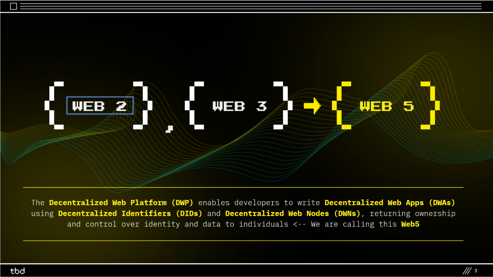
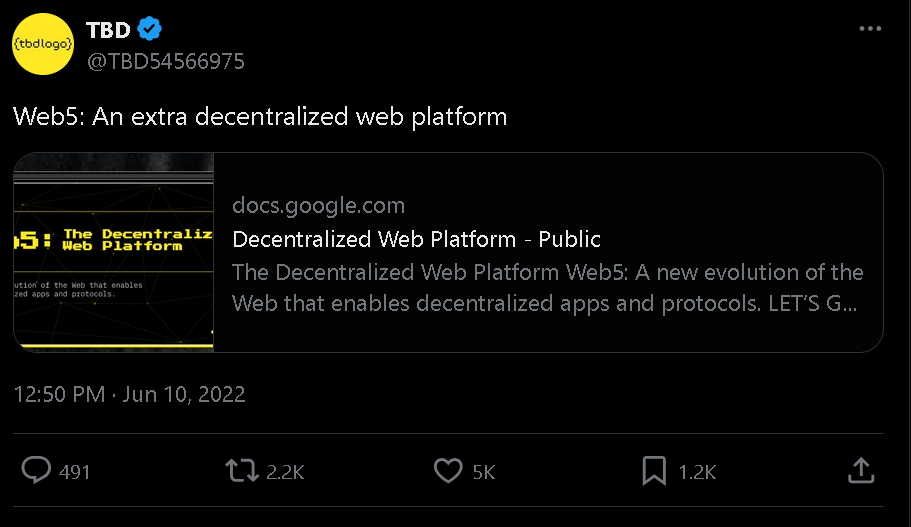
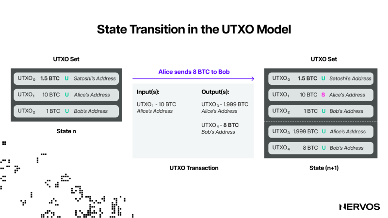
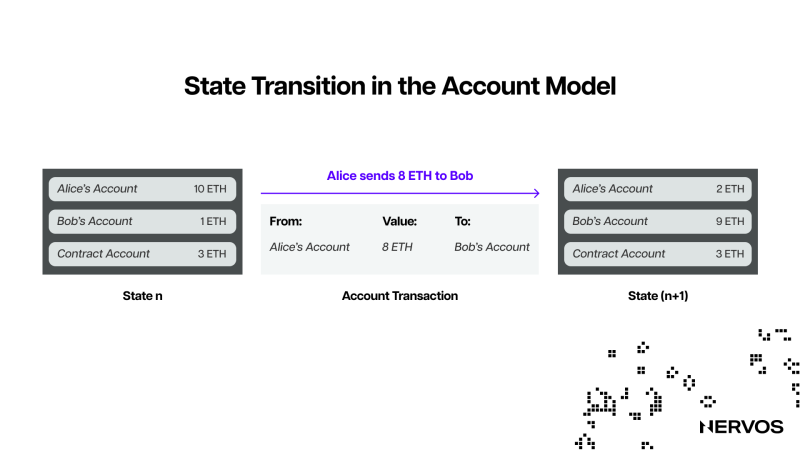
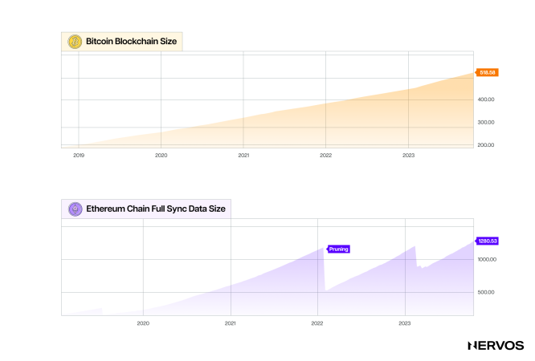
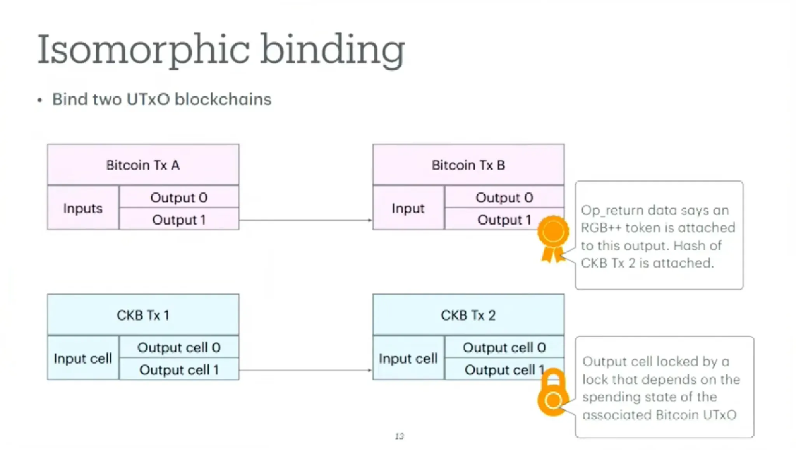

Twitter 创始人 Jack Dorsey 着手打造的 [TBD](https://tbd.website/) —— 一个全新的互联网身份与信任层，是他在加密货币领域的首个尝试之一，旨在完全基于点对点架构运行，并与现有的 Web2 服务相结合。

许多人认为 TBD 听起来很像 Web3 去中心化身份服务 [ENS](https://ens.domains/)，但 Dorsey 并不这么认为。作为一名坚定的比特币信徒（如今这个词已成为加密货币怀疑论者的代名词），他觉得有必要与主流区分开来，确保 TBD 永远不会被视为又一个 Web3 项目。

具体来说，Dorsey 意识到 Web3 —— 一个建立在开放协议和区块链之上的去中心化互联网愿景，包含身份、金融和社交层层 —— 并非他所追求的系统。

他认识到，Web3 的现实与其愿景存在根本性对立：它与互联网现有基础设施不兼容，且致力于彻底取代后者。  

*Web5 的定义 (来源: [TBD PPT](https://docs.google.com/presentation/d/1SaHGyY9TjPg4a0VNLCsfchoVG1yU3ffTDsPRcU99H1E/edit#slide=id.g12e604c56a9_0_121))*

由于 TBD 宣称的核心目标是 “去中心化” 且绝不妥协，Dorsey 选择了在比特币上构建这一系统。在他看来，仅凭这一点就足以让 TBD “不属于 Web3”，因此有必要为这类系统创造一个新术语。  

为此，Dorsey 半开玩笑地提出了 “Web5” 一词，一方面是对 Web3 的嘲讽，另一方面也是向 [HTML5](https://en.wikipedia.org/wiki/HTML5) 致敬。HTML5 是当今互联网的基础，也是 15 年前推动网络进化的最后一项重大技术尝试。

从 TBD 的[白皮书](https://github.com/TBD54566975/tbdex-whitepaper/blob/main/whitepaper.pdf)来看，Dorsey 将 Web5 视为一个以比特币作为基础共识层、闪电网络作为支付网络的点对点网络。它围绕三大支柱展开：1）自主拥有的去中心化标识符，2）可验证凭证，以及 3）用于存储数据和转发消息的去中心化网络节点。  

*“在当今的网络上，身份和个人数据已成为第三方财产。Web5 将为你的应用程序带来去中心化身份和数据存储。它让开发者专注于打造卓越的用户体验，同时将数据和身份的所有权归还给个人。”* TBD 官网如此写道。  

结合[推特文件](https://en.wikipedia.org/wiki/Twitter_Files)（一系列内部文件，揭示了推特公司如何被迫审查敏感内容）与 TBD 的目标，我们有理由认为，Dorsey 本质上想构建的是 “自由科技”。  

他对这一技术的设想典型体现在 [Nostr](https://nostr.com/) —— 一个开放的去中心化、抗审查消息传输协议，专为应对当前中心化社交媒体平台的内容审核与审查问题而设计。

对初识者而言，Nostr 的运作方式类似于区块链：每个用户生成一个私钥（需要保密）并以其公钥为身份标识。所有消息（称为 “notes”）都由其创建者进行加密签名，并可被他人验证。

Nostr 不依赖单一平台存储用户数据，而是通过独立运营的服务器（称为 “relay”）按照简单、开放的规则存储和转发消息。由于用户可选择任意 relay 或自建节点，*没有任何中央权威*能有效审查或删除内容。该协议本身极度简洁，仅定义消息格式、签名和发布方式，开发者可在此基础上构建额外的功能，比如私信、图片支持等。  

目睹中心化社交媒体公司的运作方式后，Dorsey 开始痴迷于另一种愿景：将网络应用的控制权从企业和易受操控的节点手中交还给用户。他对 Nostr 的兴趣和支持表明，我们有机会超越 Web2 的 “服务器所有制”，令人不安的是，这种模式已渗透至 Web3。  

现在，尽管我们无从得知 Dorsey 在创造 “Web5” 这个术语时是否带有讽刺意味，但可以肯定的是，他确实抓住了某些关键。尽管 TBD 从未发布产品并已[停止运营](https://github.com/TBD54566975)，Dorsey 对 Web3 缺陷的洞察依然精准且富有预见性。  

然而，他对 Web5 的愿景不必局限于比特币和[闪电网络](https://www.nervos.org/knowledge-base/ultimate_guide_to_payment_channels)。

在我们看来，Web5 的意义远超其组成部分，绝不仅是一个专用于比特币共识的 “点对点网络” 或围绕去中心化标识符构建的框架。  

更进一步，Web5 并非语义上的 “品牌重塑” 或哗众取宠的营销策略，而是互联网行业回归行业根源的实质性转向。  

我们眼中的 Web5 是一个由点对点网络组成的网状结构，连接各类 PoW（工作量证明）和 UTXO 共识层、通道网络以及其他尚未被构想出来的系统。更抽象地说，Web5 是建立在这个点对点网状结构之上的蓬勃发展的去中心化应用（dApp）生态系统。

*去中心化和点对点网络的网络拓扑结构 (来源: [CKB Eco Fund](https://ckbecofund.substack.com/p/reclaiming-the-bitcoin-p2p-vision))*

底层架构是 Web5 与 Web3 的核心差异。

Web5 建立在真正去中心化、点对点拓扑结构的网络之上，这是采用 PoW 共识和 UTXO 模型的直接结果。它不将区块链技术视为唯一核心，而是构想一系列开放的互联网协议，通过最新密码学原语增强，共同推动互联网进入新时代。  

相比之下，Web3 未能兑现去中心化、抗审查、无需许可以及数据和资产自托管的承诺，根源在于其底层架构的缺陷，尤其是选择 PoS（权益证明）和 Account 模型的决策。 

## Web3 的现状  

如今的 Web3 是无数 “名义上去中心化” 的网络的集合。自 2017 年 [MetaMask](https://metamask.io/) 和 [Infura](https://www.infura.io/) 兴起后，这些网络迅速转向[客户端-服务器](https://en.wikipedia.org/wiki/Client%E2%80%93server_model)拓扑结构。  

尽管进行了艰巨的研究和工程努力，我们得出的结论是，这一结果是构建于 PoS 和 Account 模型之上的必然产物。  

尽管我们尊重许多人为对抗这一趋势所做的原则性努力，但我们并不认为客户端-服务器拓扑结构的缺陷可被修复。在深入分析原因前，让我们先审视 Web3 的现状。  

2009 年 2 月，中本聪在[帖子](https://satoshi.nakamotoinstitute.org/posts/p2pfoundation/1/)中写道：*“传统货币的根本问题在于其运转所需的全部信任。”*  

观察今天的以太坊，“信任” 似乎有增无减。尽管质押池运营商和区块构建者并非严格意义上的可信第三方（TTP），但他们显然已成为日益重要的特权角色。  

*各实体质押的 ETH 占总质押的百分比 (来源: [dune.com](http://dune.com))*

流动性质押协议 [Lido](https://lido.fi/) 控制着约 28% 的总质押 ETH，[Coinbase](https://www.coinbase.com/) 控制着约 11%，这引发了对治理权和验证权集中于少数行业巨头的担忧。[Beaverbuild](https://beaverbuild.org/) 和 [Titan Builder](https://www.titanbuilder.xyz/) 生产了以太坊[约 89% 的区块](https://x.com/nero_eth/status/1846786871998759141)，进一步加剧了对抗审查能力和最大可提取价值（[MEV](https://cryptobriefing.com/what-is-mev-ethereums-invisible-tax-explained/)）控制的忧虑。  

此外，尽管以太坊基础层在许多指标上 —— 尤其是相比大多数 Web3 项目 —— 堪称 “足够去中心化”，但其社区选择的横向扩展路径催生了明显依赖信任假设的系统。  

<blockquote class="twitter-tweet">
Not to give away the full game. But  Yes start with one and figure out how to make crosschain interop against other chains completely seemless   Once you do that, if unichain gets too full you just make more copies of it that interop together if/when vertical scaling caps out <a href="https://t.co/rKHzxCj8VJ">https://t.co/rKHzxCj8VJ</a>
&mdash; Hayden Adams 🦄 (@haydenzadams) <a href="https://twitter.com/haydenzadams/status/1860390973739561032?ref_src=twsrc%5Etfw">November 23, 2024</a></blockquote> 
这些系统依赖充当 “服务器” 的中心化基础设施提供商，而用户则成为依赖这些服务器获取网络功能和访问权限的 “客户端”。这种架构与传统 Web2 无异，背离了 Web3 最初追求的去中心化目标。  

以 [Rollup](https://www.nervos.org/knowledge-base/zk_rollup_vs_optimistic_rollup) 为例，对中心化排序器的依赖造成了严重瓶颈。最理想情况下，单一实体完全控制交易排序与打包，用户不得不信任其行为诚实 —— 这与加密货币 “无需信任” 的宗旨背道而驰。最糟糕情况下，该实体可彻底停止链的运行，如以太坊 Layer 2 项目 Linea 今年因生态内某去中心化交易所遭攻击而[暂停排序器](https://www.dlnews.com/articles/defi/ethereum-layer-2-linea-pauses-chain-after-velocore-exploit/)。  

更糟糕的是，Linea 并非特例。几乎所有以太坊 Rollup 均为中心化运作，其运营者可审查交易或无限期停止链的运行。若一条链可被随意暂停，那么它的意义何在？传统的中心化数据库显然性能更好，为什么要运行一条链呢？

即便我们无视这些隐患，天真地假设当前 Web3 基础设施的可信第三方*值得信赖*，我们仍无法回避一个事实：正如 Nick Szabo 多年前指出的，这些第三方本质上是[安全漏洞](https://nakamotoinstitute.org/library/trusted-third-parties/)，无数安全事件已反复印证了这一点。  

例如，2023 年 7 月，跨链协议 Multichain 因疑似内部人员卷款损失超 1.25 亿美元。[漏洞根源](https://www.chainalysis.com/blog/multichain-exploit-july-2023/)在于其 CEO 赵军控制了平台大部分多方计算（MPC）密钥，而他被中国警方逮捕。一年前，Axie Infinity 的 Ronin Bridge 也发生了类似的情况，朝鲜黑客组织 Lazarus 通过控制 5/9 验证者私钥[盗取](https://www.coindesk.com/tech/2022/03/29/axie-infinitys-ronin-network-suffers-625m-exploit)超 6 亿美元的用户资金。  

<blockquote  class="twitter-tweet">
- <a  href="https://twitter.com/blast?ref_src=twsrc%5Etfw">@blast</a>  3/5 msig ($1.45B) - <a  href="https://twitter.com/0xMantle?ref_src=twsrc%5Etfw">@0xMantle</a>  6/13 msig ($1.44B) - <a  href="https://twitter.com/LineaBuild?ref_src=twsrc%5Etfw">@LineaBuild</a>  4/6 msig ($849M) - <a  href="https://twitter.com/Starknet?ref_src=twsrc%5Etfw">@Starknet</a>  2/5 msig ($676M) - <a  href="https://twitter.com/MetisL2?ref_src=twsrc%5Etfw">@MetisL2</a>  4/9 msig ($303M) - <a  href="https://twitter.com/fraxfinance?ref_src=twsrc%5Etfw">@fraxfinance</a>  3/5 msig ($170M) - <a  href="https://twitter.com/taikoxyz?ref_src=twsrc%5Etfw">@taikoxyz</a>  3/4 msig ($100M) - <a  href="https://twitter.com/loopringorg?ref_src=twsrc%5Etfw">@loopringorg</a>  4/6 msig ($45M) - <a  href="https://twitter.com/KintoXYZ?ref_src=twsrc%5Etfw">@KintoXYZ</a>  3/5 msig ($36M) <a  href="https://t.co/uLt82LdAtW">https://t.co/uLt82LdAtW</a>
&mdash;  donnoh.eth 💗 (@donnoh_eth) <a  href="https://twitter.com/donnoh_eth/status/1846833521073311906?ref_src=twsrc%5Etfw">October  17, 2024</a></blockquote> 
除信任与安全问题外，横向扩展（即通过侧链分流交易执行）还导致严重的流动性碎片化和基础设施成本问题。目前存在数十个以太坊 Layer 2，其中多数因无法吸引足够流动性而沦为幽灵链。 

*排名前两位的 Layer 2 项目 Arbitrum 和 Base 的总 TVL（321.2 亿美元）超过了其余 18 家 Layer 2 项目 TVL 的总和（114.3 亿美元）。 (来源: [L2Beat.com](L2Beat.com))*

流动性吸引交易者，交易量催生流动性，二者结合吸引 dApp 开发者。流动性碎片化使 Layer 2 深陷网络效应困境：率先突破临界点的链持续增长，其余链则逐渐凋零，最终导致流动性与用户活动集中于少数赢家。  

尽管这些系统被称为 Rollup，但它们仍是具有稀缺区块空间的区块链。这意味着成功的 Layer 2 仍会遭遇与底层链相同的可扩展性和手续费波动问题，进而催生安全性假设更复杂的 Layer 3 需求。  

链的数量增加意味着更高的基础设施成本 —— 毕竟需要有人维护所有 Rollup。即使在以太坊 [EIP-4844](https://www.eip4844.com/) 升级引入数据块（blob）并将 Layer 1 数据可用性（DA）成本降低 100 倍后，运行一个 Rollup 的月均成本仍[高达](https://www.chaincatcher.com/en/article/2142428) 1 万至 1.6 万美元（假设每月 200 万笔交易）。  

相同假设下，仅 Layer 1 成本就达 2.5 万美元，而使用 [Celestia](https://x.com/celestia) 或 [EigenDA](https://x.com/eigen_da) 等替代 DA 层的成本要便宜几个数量级。遗憾的是，对许多 Layer 2 而言，用户支付的手续费不足以覆盖基础设施成本，这意味着 “服务器” 运营者需自行承担费用。这种财务负担抬高了新参与者门槛，使资金雄厚的实体占据优势，进一步加剧中心化。  

相比之下，PoW+UTXO 链通过纵向扩展（在基础层之上添加支付通道或状态通道）实现扩容。验证保持低成本且易于访问，用户可在普通硬件上运行全节点或轻节点客户端，确保网络的广泛参与。通过 UTXO 管理状态，用户仅需验证与自身相关的交易，无需依赖中心化中间商。  

[闪电网络](https://lightning.network/)、[Ark](https://x.com/ArkLabsHQ) 和 [RGB++](https://www.rgbppfans.com/) 等协议是这一路径的典范。用户可直接建立支付通道，其安全性锚定于基础层的 PoW 共识。无需跨链桥，无需可能成为故障点的中心化排序器，这维持了网络的点对点拓扑结构，确保了真正的去中心化与抗审查性。  

## Web3 是如何走到这一步的？

要理解我们为何构建 Web5，需先厘清 Web3 在哪里出了错。最佳方式莫过于审视以太坊历史上的设计选择。  

首先，我们必须澄清，我们对以太坊（或任何其他链）都没有成见。相反，我们只是以其为例剖析 PoS +  Account 模型的缺陷。  

在这个类别中，以太坊是技术、理念与社区层面最去中心化的链，也是 Web3 叙事的发源地与主要构建平台。若以其他链为例批评 Web3，显然有失公允。此外，我们相信以太坊社区实现 Web3 目标的努力是真诚的，其失败源于十年前的决策。 

### 以太坊的第一个错误  

以太坊的第一个错误来自其最初试图将区块链变成 "世界计算机"。在[这篇文章](https://www.nervos.org/knowledge-base/optimizing_layer_1_for_modularity)中，我们深入解释了为什么这从根本上是一个糟糕的想法，所以这里我们只给出结论：区块链是用于验证的，而不是计算。

当比特币开发者 Gregory Maxwell 在九年多前[指出](https://bitcointalk.org/index.php?topic=1427885.msg14601127#msg14601127)这一点时，Vitalik Buterin曾[激烈反驳](https://www.reddit.com/r/ethereum/comments/4g1bh6/comment/d2e24sy/)。  

看看以太坊的现状，似乎 "一切上链" 的论点已被放弃。任何和所有扩展世界计算机的尝试都是通过 "在另一条链上扩展"，即更广为人知的 [Rollup-centric 路线图](https://ethereum-magicians.org/t/a-rollup-centric-ethereum-roadmap/4698)。  

换句话说，以太坊社区已放弃最初理念，转向更技术保守的 “模块化区块链” 路径。如今，基础层用于验证与最终结算，而相邻链或 Layer 2 负责交易处理。  

### 以太坊的第二个错误 

然而，这一转向未能建立点对点网络，根源在于以太坊的第二个架构错误：放弃比特币的 UTXO 模型，采用 Account 模型。  

当时，Vitalik [提出了两个论点](https://medium.com/@Consensys/thoughts-on-utxo-by-vitalik-buterin-2bb782c67e53)来证明这一转变的合理性：1）*“UTXO 在理论上复杂，实现中更甚”*；2）*“UTXO 无状态，难以支持需状态管理的复杂应用（如各类智能合约）”。*  

尽管这些论点在当时或许成立并被视作重要创新，但行业此后已取得长足进步。有状态性 —— 维护和更新区块链的 "状态" 或由过去交易产生的所有当前数据、余额和条件的集合 —— 确为计算所必需，但 Account 模型*并非*实现状态性的唯一路径。 

2017 年，Cardano 推出扩展 UTXO（[eUTXO](https://iohk.io/blog/posts/2025/01/08/six-reasons-why-eutxo-wins/)）模型；2019 年，Nervos 提出 [Cell 模型](https://medium.com/nervosnetwork/https-medium-com-nervosnetwork-cell-model-7323fca57571) —— 一种有状态的通用 UTXO 模型；近期，BitVM 开发者甚至通过 Taproot 在比特币上实现状态计算。 

回顾过去，选择 Account 模型而非 UTXO 模型似乎是一个重视短期的决定：虽便于开发者快速构建 dApp，却牺牲了 UTXO 模型的诸多天然优势。 

其中尤为关键的是 UTXO 模型如何实现资产和数据的真正所有权 —— 这恰好是 Web3 和 Web5 共同宣称的核心目标。

UTXO 模型没有传统意义上的账户，而是通过地址和未花费的交易输出（UTXO）来追踪资产所有权与转移。

UTXO 是已接收但尚未花费的加密货币单位，与指定谁可以花费它们的地址相关联。*在此模型中，用户通过控制私钥管理 UTXO 对应的资金。*这些 UTXO 的总和即用户可用资金，全程无需传统账户。  

反观 Account 模型，账户分为外部账户（EOA，由私钥控制，可发起交易）和合约账户（CA，即智能合约，不可主动发起交易，由代码与数据构成）。问题在于，在 Account 模型中，所有非原生资产（以太坊中除 ETH 外的代币）均由 CA 管理。*这意味着非原生资产在此模型中是二等公民。用户钱包中显示的代币余额并不代表实际所有权，这些代币由创建它们的 EOA 控制的 CA 管理。*  

<blockquote class="twitter-tweet">
Dear <a href="https://twitter.com/AcrossProtocol?ref_src=twsrc%5Etfw">@AcrossProtocol</a> team,  I’m writing to you during your office hours of 9-5pm on M-F and have no reason to believe today is a national holiday.   I’d like to inform you that your token contract has a critical issue.   You mistakenly exposed what was meant to be an internal… <a href="https://t.co/EpMu8zvVM8">pic.twitter.com/EpMu8zvVM8</a>
&mdash; Bryan Pellegrino (臭企鹅) (@PrimordialAA) <a href="https://twitter.com/PrimordialAA/status/1848393812777066640?ref_src=twsrc%5Etfw">October 21, 2024</a></blockquote>  

现实案例最能说明这一问题的严重性。[LayerZero](https://layerzero.network) 联合创始人兼 CEO Brian Pellegrino 近期在[推文](https://x.com/PrimordialAA/status/1848393812777066640)中指出，跨链互操作协议 [Across](https://across.to/) 的代币合约存在严重漏洞：代币合约中的某个函数允许合约所有者随时转移任意钱包中的代币。简言之，Across 团队可以从任何持有这些代币的用户那里窃取代币。

更糟糕的是，此类案例并非孤例。许多代币合约包含类似功能，允许合约所有者随意增发、销毁代币，或审查、没收用户资产。

中心化稳定币发行方默认内置此类功能（作为必要的合规手段），使其可没收涉嫌非法获取（如通过漏洞或盗窃）的代币。  

而在 UTXO 模型中，所有资产均由用户私钥直接控制，是一等公民。以采用有状态 UTXO 模型的 Nervos CKB 为例，代币合约仅定义代币逻辑（如 “总供应量 100 万枚” 或 “每区块发行 50 枚”），而记录用户余额的资产数据（如 “Alice 持有 100 枚代币”）存储于用户直接控制的 Cell（可视为有状态的 UTXO）中。这意味着，即使代币合约遭攻击，黑客也无法窃取用户资产。  

### 以太坊的第三个错误 

以太坊的第三个错误是放弃 PoW 转而采用 PoS。支持这一决策的[理由](https://medium.com/@VitalikButerin/a-proof-of-stake-design-philosophy-506585978d51)包括 “*PoS 在安全性、降低中心化风险与能效方面优势显著*” 以及 “*相同成本下安全性更高*”。但对许多读者而言，如今已显而易见：PoS 无法替代 PoW。若仍存疑，可参阅《[为何追随中本聪](https://www.theblock.co/post/275254/why-we-follow-satoshi)》或《[世界为何需要矿工](https://www.youtube.com/watch?v=4QbZ806gNsA)》。  

此外，时间也提供了反驳这些论点的证据。去年，Vitalik 本人撰写[长文](https://vitalik.eth.limo/general/2024/10/20/futures3.html)警告 PoS 固有的中心化风险。以下节选概括其核心观点：  

*“以太坊 L1 最大的风险之一是 PoS 因经济压力走向中心化。若参与核心 PoS 机制存在规模经济效应，大型质押者将自然主导网络，小型质押者则退出并加入大池子。这将导致 51% 攻击、交易审查等危机风险上升。除中心化风险外，还存在价值提取的风险：少数群体可能攫取本应属于以太坊用户的价值。”*  

尽管 Vitalik 在文中提出了若干以太坊专属解决方案，但我们认为这无济于事。中心化力量和对可信第三方的依赖是 PoS +  Account 模型区块链的天然属性。  

此外，采用 PoS 共识与 Account 模型会引发一系列连锁反应，最终使这些网络形成客户端-服务器拓扑结构，更接近完全中心化的 Web2 系统，而非 Web3 的理想形态。  

因此，实现真正去中心化、抗审查、无需许可及数据资产自托管（Web3 的目标）的唯一途径，是构建基于 PoW+UTXO 系统的点对点网络（Web5）。为理解这一点，我们需深入分析 PoS+Account 区块链与 PoW+UTXO 区块链的核心差异。  

## PoS+Account vs. PoW+UTXO

PoS+Account 系统和 PoW+UTXO 系统之间存在显著差异，其实现方式的次生影响更为深远。某些看似细微的设计选择，最终可能导致链的形态天差地别。  

我们将通过若干维度验证以下假设：**选择 PoS 或 Account 模型的链永远无法形成一个扁平的、真正的点对点网络。**  

### 状态性差异

支持我们假设的第一个维度是 PoW+UTXO 和 PoS+Account 链在状态性假设上的差异。

例如，在基于 UTXO 的系统中，交易是有状态的，包含输入与输出两个部分。每笔交易明确消耗哪些 UTXO 并生成哪些新 UTXO，即携带更新账本所需的全部状态信息。但链上环境本质上是无状态的，交易仅能影响其直接引用的 UTXO，无法修改账本其他部分。  

相反，在基于 Account 的系统中，交易是无状态的 —— 仅包含操作指令（即期望执行的动作或方法调用），而不需要明确说明相关账户的当前状态。链上环境则是有状态的，任何交易均可修改任意账户或合约的状态。例如，一个智能合约可以与多个账户交互并改变各种状态变量，导致系统状态高度互联。

在基于 UTXO 的系统中，用户创建的交易明确指定账本变更内容；而在基于 Account 的系统中，用户依赖区块链节点计算这些变更。  

就共识机制而言，PoS 共识是有状态的。验证共识需访问链上数据，特别是当前的验证者集合、他们的质押状态及随机数。由于验证者集合动态变化，节点需持续跟踪这些状态以验证新区块。  

而 PoW 共识本质上是无状态的：节点仅需验证区块头中的工作量证明即可确认区块链有效性，无需额外的链上状态信息。  

这些状态性假设的差异意味着，在 PoS+Account 模型中，用户验证交易需追踪全局状态，这要求运行全节点。  

然而，PoS+ Account 模型的状态性显著增加了全节点的存储与计算负担。节点需独立执行所有智能合约以验证交易，跟踪验证者集合及其质押量的变化，并处理与区块验证相关的认证、提案和其他数据。这导致节点需存储与计算额外的状态信息。  

数据对比可直观体现差异：运行以太坊全节点的最低要求为 2TB 固态硬盘、16GB 内存、第七代或更高版本的英特尔处理器；而运行比特币全节点仅需低端 CPU、2GB 内存和至少 15GB 的可用磁盘空间。此外，以太坊正面临[状态爆炸](https://www.theblock.co/post/258960/solving-state-bloat)问题 —— 其状态的增长速度是比特币的 3.5 倍，且无法修剪旧状态数据，这意味着状态增长没有上限。

由于运行 PoS+Account 链全节点的硬件要求较高，实际运行者寥寥无几。同时，受 PoS+Account 模型的实现复杂性与安全取舍的影响，真正无需信任的轻客户端几乎不存在（参阅我们关于此问题的[深度文章](https://www.nervos.org/knowledge-base/ultimate_guide_to_light_clients)），用户被迫依赖 [Alchemy](https://www.alchemy.com/)、[Infura](https://www.infura.io/) 等中心化 RPC 服务访问区块链。  

换句话说，PoS 共识与 Account 模型导致全节点运行困难，并且使最小化信任的轻客户端变得不可行，这导致用户别无选择，只能通过少数中心化的 RPC 和 API 来读取和更新状态。这种依赖性催生了客户端-服务器网络拓扑，与 Web2 的中心化模型无异。  

因此，“Web3” 重现了其本欲解决的 Web2 问题：缺乏安全性、隐私性与抗审查性。服务于大多数 Web3 用户的 RPC 提供商可以审查交易，这在 [OFAC 制裁 TornadoCash 事件](https://home.treasury.gov/news/press-releases/jy0916)中得到了证实。

这些 RPC 提供商还收集用户数据，包括区块链地址和 IP 地址。此外，由于大多数用户的流量依赖这些提供商，如果他们的中心化基础设施出现问题或离线，整个用户群（特别是 "大规模采用者"）将无法访问区块链，比如 2018 年 Infura 因 CryptoKitties 引发的拥堵导致[服务中断](https://consensys.io/blog/the-inside-story-of-the-cryptokitties-congestion-crisis)。  

反观 PoW+UTXO 系统，全节点、SPV 与轻客户端易于实现，用户无需依赖可信第三方即可验证交易。这促进了直接（因而更私密）的区块链参与方式与点对点网络拓扑，实现了真正的去中心化。  

### 确定性差异  

区块链本质上是复制的确定性状态机，这使其成为人人认可的 “单一真相源”。  

PoW+UTXO 与 PoS+Account 系统的确定性表现方式不同，导致网络拓扑上的差异，尤其体现在验证者选举、出块时间与终局性上。  

在 PoS 系统中，验证者选举是确定性的 —— 验证者按预设规则轮流出块。这种方式虽提升效率，却引入了脆弱性：验证者 IP 地址公开，攻击者可针对特定验证者发起 DDoS 攻击，导致其出块时段内网络瘫痪。此外，验证者必须相互了解并配合得当，因为网络的健康依赖于此。

更重要的是，确定性出块使验证者处于有利地位，可从用户处抽取经济租金。专业化公司利用资源与收入扩大质押规模，持续获取区块奖励与 MEV，形成 “富者愈富” 的正反馈循环。MEV 供应链与区块构建者的中心化进一步加剧这一趋势。  

而在 PoW 链中，验证者选举是非确定性的。在区块被挖出之前，无人知晓下一个区块由谁生成，这促进了点对点网络中节点的平等性。共识集合也是非确定性的，矿工可自由加入或退出网络，任何节点均可生成区块，没有矿工对链的延续不可或缺。这在 PoS 中是不可能的，因为共识集合是确定性的，某些验证者必须在场才能推进链的发展。

PoW 网络因此更为健壮，没有节点处于有利地位，也没有节点被保证有机会利用用户来谋取私利。

## Web5 未来可能的样子

由 PoW+UTXO 链组成的网络对许多人而言仍是天方夜谭。Web3 已成为一台工业机器，不断生产新系统以解决以太坊衍生的问题。尽管部分思考者开始理解 PoW+UTXO 的精妙之处，Web3 仍完全建立在 PoS+Account 模型之上。  

虽然 Jack Dorsey 未能带领 TBD 项目到达应许之地，但讽刺的是，Web5 的未来确实是 TBD（to be determined，有待确定）。

即使中本聪也想象过一个由庞大的区块链和工业化节点/矿工组成的世界。如今的 Web3 宇宙包含了这些；然而，我们总是在思考链：MetaMask 指向哪个 RPC？资产桥接到哪条链？地址格式是否符合规范？等等。

在这个每一个技术理念细节似乎都有代币和团队的行业中，将区块链视为链外系统的真正承诺层，反而是一片全新领域。值得庆幸的是，我们对 Web5 的愿景已经在进行中了。

尽管开始时充满争议（或许 “rgbp2p” 是一个更好的名字），[RGB++](https://talk.nervos.org/t/rgb-protocol-light-paper-translation/7790/59) 正引领 Web5 浪潮，通过无需信任的方式整合比特币与 Nervos CKB，无需跨链桥或可疑的安全机制。[Dogecoin 的支持](https://github.com/ckb-devrel/rust-dogecoin/pull/1)正在开发中，未来有望接入 [Kaspa](https://kaspa.org/)、[Ergo](https://ergoplatform.org/en/) 等 PoW+UTXO 链。  

通道网络的进展更令人振奋。2024 年大部分时间，[Fiber Network](https://www.ckbfiber.net/) 项目致力于在 CKB 上实现兼容闪电网络的通道，目前正快速迈向主网。尽管闪电网络以高难度著称，CKB 为其提供了新的计算基础，可在无需共识变更的前提下测试闪电网络的各种改进方案。  

[Polycrypt](https://github.com/perun-network) 团队在状态通道网络上工作了将近七年，最近发布了跨账户和 UTXO 模型的融合功能，支持八条链，包括以太坊、波卡、Dfinity、Cardano、Cosmos、Stellar、Fabric 和 CKB。

在 [BitVM](https://bitvm.org/) 和比特币复兴的浪潮中，随着 [Taproot Assets](https://river.com/learn/what-is-taro-in-bitcoin/) 的成熟，链下复兴也正在拉开帷幕。[Ark](https://ark-protocol.org/)、[Mercury](https://mercurylayer.com/)等团队正在探索比特币原生的链下计算的全新可能。  

## 结语  

实现 Web3 宣称的真正去中心化、抗审查、无需许可与数据资产自托管的唯一路径，是构建点对点拓扑结构的网络。迄今为止，唯有 PoW+UTXO 系统是有可能的。

在 PoW 宇宙中，区块链的成功率极低，它们更像是转瞬即逝的流星而非便利店。这些奇迹或美丽的意外仅用于共识与最终结算，人人皆可参与运行。验证保持低成本，易于访问，用户可用普通硬件运行全节点或轻客户端。  

通过垂直扩展（在基础层添加支付通道或状态通道）提升吞吐量。状态通过 UTXO 管理，允许用户在不依赖中心化中介的情况下仅验证与他们相关的交易。

创新之路总是充满不确定性，Web5 的未来亦不例外。但正如 Nervos 与 Nostr 客户端开发者 Retric 在这篇[文章](https://talk.nervos.org/t/why-nostr-is-important-the-freedom-from-being-governed-by-servers/7538)中所言：“这是一个由自由、去中心化与开放交流等价值观驱动的鲜活社区。这不仅仅是技术 —— 这是一场运动。”  

经过十年的 Web3 观察，我们见证了很少的惊喜，现在准备摆脱这些枷锁。我们已经准备好迎接不确定性。希望你也如此。  

*特别感谢 Jan、Aijan 和 Neon审阅本文并提出宝贵建议。*  

*在 X 上关注作者 [@radicalizedpleb](https://x.com/radicalizedpleb) [@matt_bitcoin](https://x.com/matt_bitcoin)*
